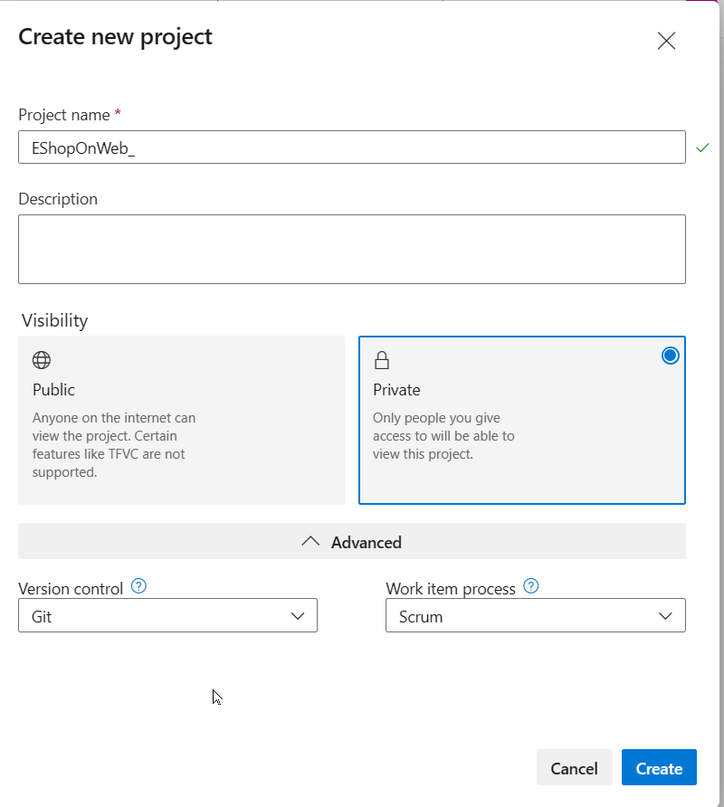

---
lab:
  title: ラボ環境を検証する
  module: 'Module 0: Welcome'
---

# ラボ環境を検証する

## 受講生用ラボ マニュアル

## Azure DevOps 組織を作成する手順 (これを行う必要があるのは 1 回だけです)

### Azure サブスクリプションがない場合はここから始めます。
1. 講師またはその他のソースから、新しい **Azure Pass プロモーションコード**を入手します。
1. プライベート ブラウザー セッションを使用し、[https://account.microsoft.com](https://account.microsoft.com) で新しい **個人 Microsoft アカウント (MSA)** を取得します。
1. 同じブラウザー セッションを使用し、[https://www.microsoftazurepass.com](https://www.microsoftazurepass.com) にアクセスし、Microsoft アカウント (MSA) を使用して Azure Pass を利用します。 詳しくは、[Microsoft Azure Pass の引き換え](https://www.microsoftazurepass.com/Home/HowTo?Length=5)に関するページをご覧ください。 引き換えの手順に従います。

### Azure のサブスクリプションがある場合はここから始めます。

1. ブラウザーを開き、[https://portal.azure.com](https://portal.azure.com) に移動し、Azure portal 画面の上部で **Azure DevOps** を検索します。 表示されたページで、**[Azure DevOps 組織]** をクリックします。
1. 次に、**My Azure DevOps Organizations** というラベルの付いたリンクをクリックするか、[https://aex.dev.azure.com](https://aex.dev.azure.com) に直接移動します。
1. **[We need a few more details](詳細情報をいくつか入力する必要があります)** ページで、 **[続行]** を選びます。
1. 左側のドロップダウン ボックスで、"Microsoft アカウント" の代わりに **[既定のディレクトリ]** を選択します。
1. プロンプト ( *[We need a few more details](詳細情報をいくつか入力する必要があります)* ) が表示されたら、名前、メールアドレス、場所を入力して、 **[続行]** をクリックします。
1. **[既定のディレクトリ]** を選択した状態で [https://aex.dev.azure.com](https://aex.dev.azure.com) に戻り、青いボタン **[新しい組織の作成]** をクリックします。
1. **[続行]** をクリックして*利用規約*に同意します。
1. プロンプト ( *[Almost done](ほぼ完了)* ) が表示されたら、Azure DevOps 組織の名前を既定のままにし (グローバルに一意の名前である必要があります)、一覧から最寄りのホスティング場所を選びます。
1. 新しく作成した組織が **Azure DevOps** で開いたら、左下隅にある **[組織の設定]** をクリックします。
1. **[組織の設定]** 画面で、 **[課金]** をクリックします (この画面を開くには数秒かかります)。
1. **[課金の設定]** をクリックし、画面の右側で **[Azure Pass] - [スポンサーシップ** サブスクリプション] を選択し、 **[保存]** をクリックしてサブスクリプションを組織にリンクします。
1. 画面の上部にリンクされた Azure サブスクリプション ID が表示されたら、**MS Hosted CI/CD** の**有料並列ジョブ**の数を 0 から **1** に変更します。 次に、下部にある **[保存]** をクリックします。
1. **[組織の設定]** のセクション **[パイプライン]** に移動し、 **[設定]** をクリックします。
1. **[Disable creation of classic build pipelines] (クラシック ビルド パイプラインの作成を無効にする)** と **[Disable creation of classic release pipelines] (クラシック リリース パイプラインの作成を無効にする)** のスイッチを **[オフ]** に切り替えます
    > 注: **[Disable creation of classic release pipelines] (クラシック リリース パイプラインの作成を無効にする)** スイッチを **[オン]** に設定すると、DevOps プロジェクトの **[パイプライン]** セクションの **[リリース]** メニューなどのクラシック リリース パイプラインの作成オプションは非表示になります。
1. **[組織設定]** で、 **[セキュリティ]** セクションに移動し、 **[ポリシー]** をクリックします。
1. **[OAuth を使用したサード パーティ アプリケーションのアクセス]** のスイッチを **[オン]** に切り替えます。
    > 注: OAuth 設定は、DemoDevOpsGenerator などのツールで拡張機能を登録できるようにするのに役立ちます。 これがないと、必要な拡張機能が不足して、いくつかのラボが失敗するおそれがあります。
1. **[パブリック プロジェクトを許可します]** のスイッチを **[オン]** に切り替える
    > 注: 一部のラボで使用される拡張機能では、無料版の使用を許可するためにパブリック プロジェクトが必要になる場合があります。
1. 新しい設定がバックエンドに反映されるように、**CI/CD 機能を使用する前に少なくとも 3 時間待ちます**。 それができなかった場合、 *"ホストされた並列処理は購入も許可もされていません"* というメッセージが依然として表示されます。

## サンプルの Azure DevOps プロジェクトを作成する手順 (これを行う必要があるのは 1 回だけです)

### 演習 0:ラボの前提条件の構成

> **注**: これらの手順を続ける前に、Azure DevOps 組織を作成する手順を完了していることを確認してください。

この演習では、ラボの前提条件を設定します。これは、[eShopOnWeb](https://github.com/MicrosoftLearning/eShopOnWeb) に基づくリポジトリを含む新しい Azure DevOps プロジェクトで構成されます。

#### タスク 1: チーム プロジェクトを作成して構成する

このタスクでは、複数のラボで使用される **eShopOnWeb** Azure DevOps プロジェクトを作成します。

1. ラボ コンピューターのブラウザー ウィンドウで、Azure DevOps 組織を開きます。 **[新しいプロジェクト]** をクリックします。 プロジェクトに次の設定を指定します。
    - 名前: **eShopOnWeb**
    - 可視性: **プライベート**
    - 詳細設定: バージョン コントロール: **Git**
    - 詳細設定: 作業項目プロセス: **スクラム**

2. **Create** をクリックしてください。

    

#### タスク 2: eShopOnWeb Git リポジトリをインポートする

このタスクでは、複数のラボで使用される eShopOnWeb Git リポジトリをインポートします。

1. ラボ コンピューターのブラウザー ウィンドウで、Azure DevOps 組織と、前に作成した **eShopOnWeb** プロジェクトを開きます。 **[リポジトリ] > [ファイル]** 、 **[リポジトリをインポートする]** をクリックします。 **[インポート]** を選択します。 **[Git リポジトリをインポートする]** ウィンドウで、URL https://github.com/MicrosoftLearning/eShopOnWeb.git を貼り付けて、 **[インポート]** をクリックします。

    

2. リポジトリは次のように編成されています。
    - **.ado** フォルダーには、Azure DevOps の YAML パイプラインが含まれています。
    - **.devcontainer** フォルダーには、コンテナーを使って開発するためのセットアップが含まれています (VS Code でローカルに、または GitHub Codespaces で)。
    - **.azure** フォルダーには、一部のラボ シナリオで使用される Bicep&ARM コードとしてのインフラストラクチャ テンプレートが含まれています。
    - **.github** フォルダーには、YAML GitHub ワークフローの定義が含まれています。
    - **src** フォルダーには、ラボ シナリオで使用される .NET 7 Web サイトが含まれています。

これで、この AZ-400 コースのさまざまな個々のラボを続けるために必要な前提条件の手順が完了しました。
