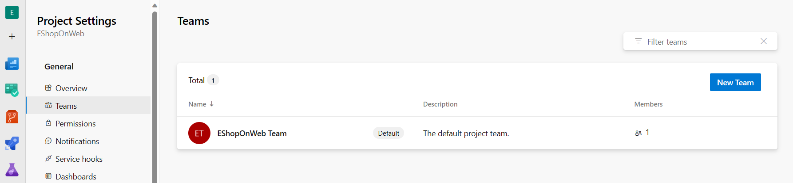
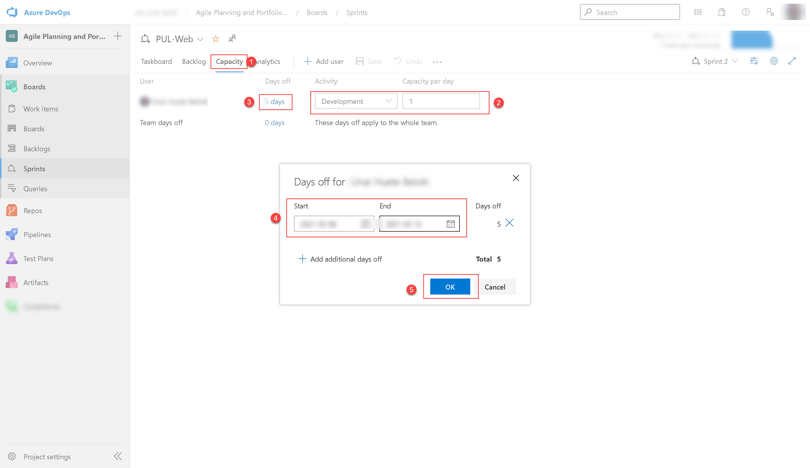
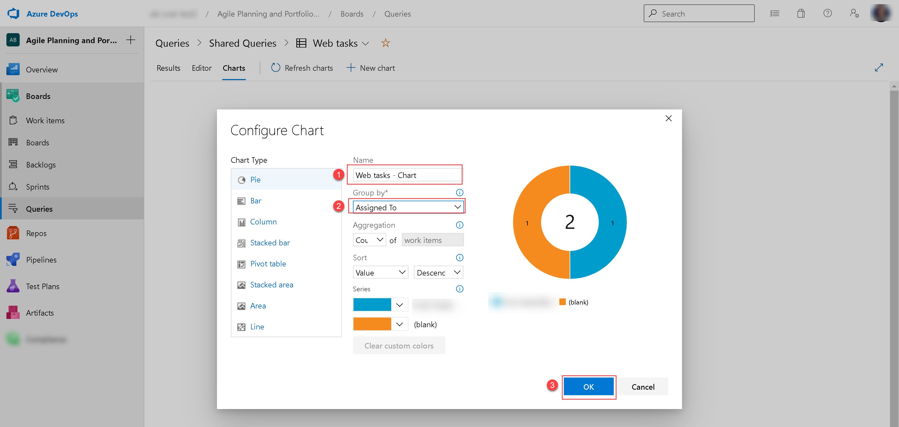

---
lab:
  title: ラボ 01:Azure Boards を使用したアジャイル プランニングとポートフォリオ管理
  module: 'Module 1: Get started on a DevOps transformation journey'
ms.openlocfilehash: b67811c9d2397ad082be78bb30d87955f4cba455
ms.sourcegitcommit: f72fcf5ee578f465b3495f3cf789b06c530e88a4
ms.translationtype: HT
ms.contentlocale: ja-JP
ms.lasthandoff: 03/04/2022
ms.locfileid: "139262443"
---
# ラボ 01:Azure Boards を使用したアジャイル プランニングとポートフォリオ管理
# 受講生用ラボ マニュアル

## ラボの概要

このラボでは、Azure Boards が提供するアジャイル プランニングとポートフォリオ管理のツールとプロセス、およびチーム全体で作業をすばやく計画、管理、ならびに追跡する方法について説明します。 イテレーションの過程で作業フローを追跡するために使用できる製品バックログ、スプリント バックログ、およびタスク ボードについて学習します。 また、大規模なチームや組織向けに拡張するためにこのリリースでツールがどのように強化されたかについても説明します。

## 目標

このラボを完了すると、次のことができるようになります。

-   チーム、領域、イテレーションの管理
-   作業項目の管理
-   スプリントと容量の管理
-   かんばんボードのカスタマイズ
-   ダッシュボードの定義
-   チーム プロセスのカスタマイズ

## ラボの所要時間

-   予想所要時間: **60 分**

## Instructions

### 開始する前に

#### ラボ仮想マシンにサインインする

次の認証情報を使用して、Windows 10 仮想マシンにサインインしていることを確認します。
    
-   ユーザー名: **Student**
-   パスワード: **Pa55w.rd**

#### このラボで必要なアプリケーションのレビュー

このラボで使用するアプリケーションを特定:
  
-   Microsoft Edge

#### Azure DevOps 組織を設定する

このラボで使用できる Azure DevOps 組織がまだない場合は、[組織またはプロジェクト コレクションの作成](https://docs.microsoft.com/en-us/azure/devops/organizations/accounts/create-organization?view=azure-devops)で利用できる手順に従って作成してください。

### 演習 0:ラボの前提条件の構成

この演習では、ラボの前提条件を設定します。Azure DevOps Demo Generator テンプレートに基づいて事前構成された Parts Unlimited チームプロジェクトで構成されます。

#### タスク 1:チーム プロジェクトを構成する

このタスクでは、Azure DevOps Demo Generator を使用し、**Parts Unlimited** テンプレートに基づいて新しいプロジェクトを生成します。

1.  ラボのコンピューターで Web ブラウザーを起動し、[<Azure DevOps Demo Generator](https://azuredevopsdemogenerator.azurewebsites.net) に移動します。 このユーティリティ サイトは、ラボで必要なコンテンツ (作業項目、リポジトリなど) が事前設定されている新しい Azure DevOps プロジェクトをアカウント内で作成するプロセスを自動化します。 

    > **注**:サイトの詳細については、 https://docs.microsoft.com/en-us/azure/devops/demo-gen を参照してください。

1.  「**サインイン**」をクリックし、Azure DevOps サブスクリプションに関連のある Microsoft アカウントを使用してサインインします。

    

1.  必要な場合は、「**Azure DevOps Demo Generator**」ページで「**承諾する**」をクリックし、Azure DevOps サブスクリプションへのアクセス許可要求を承諾します。
1.  「**新規プロジェクトの作成**」ページで、「**新しいプロジェクト名**」テキストボックスに、「**Agile Planning and Portfolio Management with Azure Boards**」を入力し、「**組織の選択**」ドロップダウン リストで、Azure DevOps 組織を選択し、「**テンプレートの選択**」をクリックします。
1.  テンプレートのリストで、**PartsUnlimited** テンプレートを見つけ、「**テンプレートの選択**」をクリックします。

    

1.  再び「**新しいプロジェクトの作成**」ページで「**プロジェクトの作成**」をクリックします。

    

    > **注**:プロセスが完了するまでお待ちください。 これには 2 分ほどかかります。 プロセスが失敗した場合は、Azure DevOps 組織に移動し、プロジェクトを削除して、再試行してください。

1.  「**新しいプロジェクトの作成**」ページで「**プロジェクトに移動**」をクリックします。

    

### 演習 1:アジャイル プロジェクトの管理

この演習では、Azure Boards を使用して、チーム、エリア、イテレーション、作業項目、スプリント、キャパシティの管理、かんばんボードのカスタマイズ、ダッシュボードの定義、チーム プロセスのカスタマイズなど、一般的なアジャイル計画とポートフォリオ管理タスクを実行します。

#### タスク 1:チーム、領域、イテレーションの管理

このタスクでは、新しいチームを作成し、そのエリアとイテレーションを構成します。 

新しいプロジェクトはそれぞれ、プロジェクト名と一致するデフォルトのチームで構成されます。 追加のチームを作成するオプションがあります。 各チームには、一連のアジャイル ツールとチーム アセットへのアクセスを許可できます。 複数のチームを作成する機能により、企業全体の自律性とコラボレーションの間の適切なバランスを柔軟に選択できます。 

1.  前の演習で生成した **アジャイル計画と Azure Boardsを使用したポートフォリオ管理** プロジェクトを使用して、Web ブラウザーに Azure DevOps 組織が表示されることを確認します。 

    > **注**:または、[https://dev.azure.com/`<your-Azure-DevOps-account-name>` /Agile%20Planning%20and%20Portfolio%20Management%20with%20Azure%20Boards) の URL に移動して、プロジェクト ページに直接アクセスすることもできます。`<your-Azure-DevOps-account-name>` プレースホルダーは、お使いのアカウント名を表します。 

1.  ページの左下隅にある 「**プロジェクト設定**」というラベルの付いた歯車アイコンをクリックして、「**プロジェクト設定**」ページを開きます。

    

1.  「**全般**」セクションで、「**チーム**」タブを選択します。このプロジェクトにはすでにいくつかのチームがありますが、このラボ用に新しいチームを作成します。 「**新しいチーム**」をクリックします。

    

1.  「**新しいチームの作成**」ペインの 「**チーム名**」テキストボックスに「**PUL-Web**」と入力し、他の設定をデフォルト値のままにして、「**作成**」をクリックします。

    

1.  **チーム** のリストで、新しく作成されたチームを選択して、その詳細を表示します。

    > **注**:デフォルトでは、新しいチームのメンバーはあなただけです。 このビューを使用して、チームメンバーシップ、通知、ダッシュボードなどの機能を管理できます。 

1.  「**PUL-Web**」ページの上部にある 「**イテレーションとエリア パス**」リンクをクリックして、チームのスケジュールとスコープの定義を開始します。

    

1.  「**ボード**」ペインの上部にある 「**イテレーション**」タブを選択し、「 **+イテレーションの選択**」をクリックします。

    

1.  「**Azure Boards \ Sprint 1 を使用したアジャイル計画とポートフォリオ管理**」を選択し、「**保存して閉じる**」をクリックします。 この最初のスプリントはすでに通過していることに注意してください。 これは、デモ データ ジェネレーターがプロジェクト履歴を構築するように設計されているため、このスプリントは過去に発生します。

    > **注**:新しいチームは、他のチームにすでに設定されているのと同じイテレーション スケジュールを使用しますが、組織により適している場合は、カスタムのイテレーション スケジュールを作成できます。

1.  前の手順を繰り返して、**スプリント 2** と **スプリント 3** を追加します。 2 番目のスプリントは現在のイテレーションであり、3 番目は近い将来のイテレーションです。

    

1.  「**ボード**」ペインで、ペインの上部にある 「**エリア**」タブを選択します。チームの名前と一致する名前の自動生成されたエリアがあります。
1.  **デフォルト エリア** エントリの横にある省略記号をクリックし、ドロップダウン リストで **[サブ エリアを含める]** を選択します。 

    

    > **注**:すべてのチームのデフォルト設定では、サブエリア パスが除外されています。 チームがすべてのチームのすべての作業項目を可視化できるように、サブエリアを含めるように変更します。 オプションで、管理チームはサブエリアを含めないことを選択することもできます。これにより、作業項目がチームの 1 つに割り当てられるとすぐに、作業項目がビューから自動的に削除されます。

#### タスク 2:作業項目の管理

このタスクでは、一般的な作業項目管理タスクを順を追って説明します。 

作業項目は、Azure DevOps で重要な役割を果たします。 実行する作業、リリースの障害、テスト定義、またはその他の重要な項目を説明するかどうかにかかわらず、作業項目は現代のプロジェクトの主力です。 このタスクでは、さまざまな作業項目を使用して、製品トレーニング セクションで Parts Unlimited サイトを拡張する計画を設定することに焦点を当てます。 会社の製品のこのような重要な部分を構築するのは困難な場合がありますが、Azure DevOps とスクラム プロセスにより非常に管理しやすくなっています。

> **注**:このタスクは、さまざまな種類の作業項目を作成するさまざまな方法を説明し、プラットフォームで使用できる機能の幅を示すことを目的としています。 結果として、これらのステップは、プロジェクト管理のための規範的なガイダンスと見なされるべきではありません。 これらの機能は、プロセスのニーズに合わせて十分に柔軟にすることを目的としているため、調査と実験を行ってください。

1.  Azure DevOps ポータルの垂直ナビゲーション ペインで、「**リポジトリ**」アイコンを選択し、「**作業項目**」を選択します。
 
    > **注**:Azure DevOps で作業項目を作成する方法はたくさんありますが、そのうちのいくつかを見ていきます。 ダッシュボードから 1 つを起動するのと同じくらい簡単な場合もあります。 

1.  **「作業項目」** ウィンドウで、 **「+ 新しい作業項目」> 「エピック」** をクリックします。

    

1.  「**タイトルの入力**」テキストボックスに、「**製品トレーニング**」と入力します。 
1.  左上隅にある 「**未割り当て**」エントリを選択し、ドロップダウン リストでユーザー アカウントを選択して、新しい作業項目を自分に割り当てます。 
1.  「**エリア**」エントリの横にある 「**Azure Boards を使用したアジャイル計画とポートフォリオ管理**」エントリを選択し、ドロップダウン リストで 「**PUL-Web**」を選択します。 これにより、**エリア** が **Azure Boards \ PUL-Webを使用したアジャイル計画とポートフォリオ管理** に設定されます。 
1.  「**イテレーション**」エントリの横にある 「**Azure Boards を使用したアジャイル計画とポートフォリオ管理**」エントリを選択し、ドロップダウン リストで 「**Sprint 2**」を選択します。 これにより、**イテレーション** が **Azure Boards \ スプリント 2 を使用したアジャイル計画とポートフォリオ管理** に設定されます。 
1.  **[保存]** をクリックして、変更を確定します。 **閉じないでください**。

    

    > **注**:通常は、できるだけ多くの情報を入力する必要がありますが、このラボの目的にはこれで十分です。

    > **注**:作業項目フォームには、関連するすべての作業項目設定が含まれています。 これには、割り当てられたユーザー、多くのパラメーターにわたるステータス、および作成以降の処理方法に関するすべての関連情報と履歴に関する詳細が含まれます。 焦点を当てるべき重要な分野の 1 つは、**関連作業** です。 このエピックに機能を追加する方法の 1 つを探ります。 

1.  右下にある **[関連作業]** セクションで、 **[リンクの追加]** エントリを選択し、ドロップダウン リストで **[新しい項目]** を選択します。
1.  「**リンクの追加**」パネルの 「**作業項目の種類**」ドロップダウン リストで、「**機能**」を選択し、「**タイトル**」テキスト ボックスに「**トレーニング ダッシュボード**」と入力して、「**OK**」をクリックします。

 
    ![タイトル "トレーニング ダッシュボード" を含めて、[OK] をクリックします](images/m1/child_feature_v1.png)

    > **注**:「**トレーニング ダッシュボード**」パネルで、割り当て、**エリア**、**イテレーション** が、機能の基になっているエピックと同じ値にすでに設定されていることに注意してください。 さらに、この機能は、作成元の親アイテムに自動的にリンクされます。 

1.  「**トレーニング ダッシュボード**」パネルで、「**保存して閉じる**」をクリックします。

    

1.  Azure DevOps ポータルの垂直ナビゲーション ペインの 「**ボード**」項目のリストで、「**ボード**」を選択します。
1.  「**ボード**」パネルで、「**PUL-Web ボード**」エントリを選択します。 これにより、その特定のチームのボードが開きます。

    

1.  「**ボード**」パネルの右上隅にある 「**バックログ項目**」エントリを選択し、ドロップダウン リストで 「**機能**」を選択します。 

    > **注**:これにより、タスクやその他の作業項目を機能に簡単に追加できます。

1.  **トレーニング ダッシュボード** 機能を表す長方形の上にマウス ポインタを置きます。 これにより、右上隅に省略記号が表示されます。
1.  省略記号アイコンをクリックし、ドロップダウン リストで **[製品バックログ項目の追加]** を選択します。

    

1.  新製品のバックログ項目のテキストボックスに、「**顧客として、新しいチュートリアルを表示する**」と入力し、**Enter** キーを押してエントリを保存します。 

    > **注**:これにより、機能の子であり、そのエリアとイテレーションを共有する新しい製品バックログ項目 (PBI) 作業項目が作成されます。

1.  前の手順を繰り返して、顧客が最近表示したチュートリアルを表示し、それぞれ **顧客として、最近表示したチュートリアルを表示する**、**顧客として、新しいチュートリアルを要求する** という名前の新しいチュートリアルを要求できるように設計された 2 つの PBI を追加します。

    

1.  「**ボード**」パネルの右上隅にある 「**機能**」エントリを選択し、ドロップダウン リストで 「**バックログ項目**」を選択します。

    > **注**:バックログ項目には、完了に対する相対的な位置を定義する状態があります。 フォームを使用して作業項目を開いて編集することもできますが、ボード上でカードをドラッグする方が簡単です。 

1.  「**PUL-Web**」パネルの 「**ボード**」タブで、「**顧客として、新しいチュートリアルを表示する**」という名前の最初の作業項目を 「**新規**」から 「**承認済み**」ステージにドラッグします。

    

    > **注**:作業項目カードを展開して、便利に編集可能な詳細を表示することもできます。

1.  「**承認済み**」ステージに移動した作業項目を表す長方形の上にマウス ポインタを置きます。 これにより、下向きのキャレット記号が表示されます。 
1.  下向きのキャレット記号をクリックしてワークアイテムカードを展開し、「**未割り当て**」エントリを選択し、ユーザー アカウントのリストでアカウントを選択して、移動した PBI を自分に割り当てます。
1.  「**PUL-Web**」パネルの 「**ボード**」タブで、「**顧客として、最近表示したチュートリアルを表示する**」という名前の 2 番目の作業項目を 「**新規**」から 「**コミット済み**」ステージにドラッグします。
1.  「**PUL-Web**」パネルの 「**ボード**」タブで、「**顧客として、新しいチュートリアルを要求する**」という名前の 3 番目の作業項目を 「**新規**」から 「**完了**」ステージにドラッグします。

    

    > **注**:タスク ボードは、バックログの 1 つのビューです。 表形式のビューを使用することもできます。

1.  「**PUL-Web**」ペインの 「**ボード**」タブで、ペインの上部にある 「**バックログとして表示**」をクリックして、表形式を表示します。

    

    > **注**:「**PUL-Web**」パネルの 「**バックログ**」タブ ラベルのすぐ下にあるプラス記号を使用して、これらの作業項目の下にネストされたタスクを表示できます。 

    > **注**:最初のバックログ項目のすぐ左にある 2 番目のプラス記号を使用して、新しいタスクを追加できます。

1.  「**PUL-Web**」ペインの 「**バックログ**」タブで、ペインの左上隅にある、最初の作業項目の横にある上から 2 番目のプラス記号をクリックします。 これにより、「**新しいタスク**」パネルが表示されます。

    

1.  「**新しいタスク**」パネルの上部にある 「**タイトルの入力**」テキストボックスに、「**最新のチュートリアルのページを追加**」と入力します。 
1.  「**新しいタスク**」パネルの 「**残りの作業**」テキストボックスに **5** と入力します。
1.  「**新しいタスク**」パネルの 「**アクティビティ**」ドロップダウン リストで、「**開発**」を選択します。 
1.  「**新しいタスク**」パネルで、「**保存して閉じる**」をクリックします。

    

1.  最後の 5 つの手順を繰り返して、「**最新のチュートリアルのデータクエリの最適化**」という名前の別のタスクを追加します。 **残りの作業** を **3** に設定し、**アクティビティ** を **設計** に設定します。 完了したら、「**保存して閉じる**」をクリックします。

#### タスク 3:スプリントと容量の管理

このタスクでは、一般的なスプリントと容量の管理タスクを順を追って説明します。

チームは、通常、スプリントの初日に開催されるスプリント計画会議中にスプリント バックログを作成します。 各スプリントは、アジャイル プロセスとツールを使用して作業するチームの能力をサポートするタイムボックス化された間隔に対応します。 計画会議中に、製品の所有者はチームと協力して、スプリントで完了するストーリーまたはバックログ項目を特定します。

計画会議は通常、2 つの部分で構成されます。 最初の部分では、チームと製品の所有者は、以前のスプリントの経験に基づいて、チームがスプリントで完了することを約束できると感じるバックログ項目を特定します。 これらの項目はスプリント バックログに追加されます。 2 つ目の部分では、チームは各項目をどのように開発およびテストするかを決定します。 次に、各項目を完了するために必要なタスクを定義および見積もります。 最後に、チームはこれらの見積もりに基づいて一部またはすべての項目を実装することを約束します。

スプリント バックログには、チームが最後に急ぐことなく、割り当てられた時間内に作業を正常に計画して完了するために必要なすべての情報が含まれている必要があります。 スプリントを計画する前に、バックログを作成、優先順位付け、見積もり、スプリントを定義しておく必要があります。 

1.  Azure DevOps ポータルの垂直ナビゲーション ペインで、「**ボード**」アイコンを選択し、「**ボード**」項目のリストで 「**スプリント**」を選択します。
1.  「**スプリント**」ビューの 「**タスクボード**」タブのツールバーの右側で、「**表示オプション**」記号 (目標到達プロセス アイコンのすぐ左) を選択し、「**表示オプション**」ドロップダウン リストで 「**作業の詳細**」エントリを選択します。

    

    > **注**:現在のスプリントの範囲はかなり限られています。 **To Do** ステージには 2 つのタスクがあります。 この時点では、どちらのタスクも割り当てられていません。 どちらも、残りの作業見積もりを表す **未割り当て** エントリの右側に数値を表示します。 

1.  「**最新のチュートリアルの追加**」ページを表す長方形で、「**未割り当て**」エントリをクリックし、ユーザー アカウントのリストで、自分のアカウントを選択してタスクを自分に割り当てます。
1.  **最新のチュートリアルのページを追加** タスクを自分に割り当てます。 

    > **注**:これにより、 **[作業者:割り当て先]** セクション ( **[作業の詳細]** ペイン) が自動的に更新されます。

1.  「**スプリント**」ビューの 「**容量**」タブを選択します。 

    > **注**:このビューでは、ユーザーが実行できるアクティビティと容量のレベルを定義できます。 

1.  「**スプリント**」ビューの 「**アクティビティ**」ラベルのすぐ下にある 「**未割り当て**」ドロップダウン リストの 「**容量**」タブで、「**開発**」を選択し、「**1 日あたりの容量**」テキストボックスに **1** と入力します。 

    > **注**:これは、1 日あたり 1 時間の開発作業を表します。 ユーザーが開発以外のことを行う場合は、ユーザーごとにアクティビティを追加できることに注意してください。 

    > **注**:休暇を取ると仮定しましょう。 

1.  「**スプリント**」ビューの 「**容量**」タブで、ユーザー アカウントを表すエントリのすぐ横にある 「**休日**」列で、「**0 日**」エントリをクリックします。 これにより、休日を設定できるパネルが表示されます。
1.  表示されたパネルで、カレンダー ビューを使用して、現在のスプリント中 (次の 3 週間以内) に 5 営業日にわたる休暇を設定し、完了したら 「**OK**」をクリックします。

    

1.  「**スプリント**」ビューの 「**容量**」タブに戻り、「**保存**」をクリックします。
1.  「**スプリント**」ビューの 「**タスクボード**」タブを選択します。

    

    > **注**:「**作業の詳細**」パネルは、使用可能な帯域幅を反映するように更新されていることに注意してください。 「**作業の詳細**」パネルに表示される実際の数は異なる場合がありますが、1 日あたり 1 時間を割り当てているため、スプリントの合計容量はスプリントが終了するまでの残りの稼働日数と同じになります。 次の手順で使用するため、この値をメモしてください。

    > **注**:ボードの便利な機能の 1 つは、主要なデータをインラインで簡単に更新できることです。 各タスクに予想される時間を反映するために、**残りの作業** の見積もりを定期的に更新することをお勧めします。 「**最新のチュートリアル タスクの追加**」ページの作業を確認し、実際には当初の予想よりも時間がかかることがわかったとします。 

1.  「**スプリント**」ビューの 「**タスクボード**」タブで、「**最新のチュートリアルの追加**」ページを表す正方形ボックスで、前の手順で特定したこのスプリントの合計容量に一致する推定時間数を設定します。

    

    > **注**:これにより、**開発** と個人の能力が自動的に最大に拡張されます。 割り当てられたタスクをカバーするのに十分な大きさであるため、環境に配慮しています。 ただし、**最新のチュートリアルタスクのデータクエリの最適化** にさらに 3 時間かかるため、**チーム** 全体の容量を超えています。

    > **注**:この容量の問題を解決する 1 つの方法は、タスクを将来のイテレーションに移動することです。 これを行うにはいくつかの方法があります。 たとえば、ここでタスクを開き、パネル内で編集して、タスクの詳細にアクセスできます。 別のアプローチは、「**バックログ**」ビューを使用することです。これは、それを移動するためのインライン メニュー オプションを提供します。 ただし、この時点では、まだタスクを移動しないでください。

1.  「**スプリント**」ビューの 「**タスクボード**」タブのツールバーの右側で、「**表示オプション**」記号 (目標到達プロセス アイコンのすぐ左) を選択し、「**表示オプション**」ドロップダウン リストで 「**連絡先**」エントリを選択します。

    

    > **注**:これにより、バックログ項目はなく、個人ごとにタスクの進行状況を確認できるようにビューが調整されます。

    > **注**:利用可能なカスタマイズもたくさんあります。 

1.  「**チーム設定の構成**」歯車アイコン (目標到達プロセス アイコンのすぐ右側) をクリックします。
1.  「**設定**」パネルで、「**スタイル**」タブを選択し、「 **+ スタイル ルール**」をクリックします。「**ルール名**」ラベルの下の 「**名前**」テキストボックスに「**開発**」と入力し、「**カードの色**」ドロップダウン リストで緑色の長方形を選択します。 

    > **注**:これにより、すぐ下の 「**ルール基準**」セクションで設定されたルール基準を満たす場合、すべてのカードが緑色になります。

1.  **[ルール基準]** セクションの **[フィールド]** ドロップダウン リストで **[アクティビティ]** を選択し、 **[オペレーター]** ドロップダウン リストで **=** を選択し、 **[値]** ドロップダウン リストで **[開発]** を選択します。 

    

    > **注**:これにより、**開発** アクティビティに割り当てられたすべてのカードが緑色に設定されます。

1.  「**設定**」パネルで、「**バックログ**」タブを選択します。 

    > **注**:このタブのエントリを使用すると、ナビゲーションに使用できるレベルを設定できます。 エピックはデフォルトでは含まれていませんが、変更することができます。

1.  「**設定**」パネルで、「**営業日**」タブを選択します。 

    > **注**:このタブのエントリでは、チームが従う **営業日** を指定できます。 これは、容量とバーンダウンの計算に適用されます。

1.  「**設定**」パネルで、「**バグの処理**」タブを選択します。 

    > **注**:このタブのエントリを使用すると、ボード上でのバグの表示方法を指定できます。

1.  「**設定**」パネルで、「**保存して閉じる**」をクリックし、スタイル ルールを保存します。

    > **注**:**開発** に関連するタスクは緑色になり、非常に簡単に識別できます。

#### タスク 4:かんばんボードのカスタマイズ

このタスクでは、かんばんボードをカスタマイズするプロセスを順を追って説明します。

高品質のソフトウェアを一貫して提供するチームの能力を最大化するために、かんばんは 2 つの主要なプラクティスを強調しています。 1 つ目は、作業の流れを視覚化するために、チームのワークフロー ステージをマッピングし、それに合わせてかんばんボードを構成する必要があります。 2 つ目は、進行中の作業量を制限するために、仕掛品 (WIP) の制限を設定する必要があります。 これで、かんばんボードの進捗状況を追跡し、主要な指標を監視してリードまたはサイクルタイムを短縮する準備が整いました。 かんばんボードによってバックログは対話型の掲示板になり、視覚的な作業フローが表示されます。 作業が構想から完了まで進むにつれて、ボード上の項目を更新します。 各列は作業段階を示し、各カードはその作業段階のユーザーのストーリー (青いカード) またはバグ (赤いカード) を表します。 ただし、すべてのチームは時間の経過とともに独自のプロセスを開発するため、チームの作業方法に合わせてかんばんボードをカスタマイズする機能は、配信を成功させるために重要です。

1.  Azure DevOps ポータルの垂直ナビゲーション ペインの 「**ボード**」項目のリストで、「**ボード**」を選択します。
1.  「**ボード**」パネルで、「**チーム設定の構成**」歯車アイコン (目標到達プロセス アイコンのすぐ右側) をクリックします。

    > **注**:チームはデータを使用して行われる作業に重点を置いているため、データへのアクセスまたはデータの保存に関連するすべてのタスクに特別な注意が払われています。 

1.  「**設定**」パネルで、「**タグの色**」タブを選択し、「 **+ タグの色**」をクリックして、「**タグ**」テキストボックスに **データ** を入力し、デフォルトの色のままにします。

    

    > **注**:バックログアイテムまたはバグが **データ** でタグ付けされると、そのタグが強調表示されます。

1.  「**設定**」パネルで、「**注釈**」タブを選択します。

    > **注**:カードに含める **注釈** を指定して、カードを読みやすく、ナビゲートしやすくすることができます。 注釈を有効にすると、各カードの視覚化をクリックすることで、そのタイプの子作業項目に簡単にアクセスできます。

1.  「**設定**」パネルで、「**テスト**」タブを選択します。

    > **注**:「**テスト**」タブでは、カードでのテストの表示方法と動作を構成できます。

1.  「**設定**」パネルで、「**保存して閉じる**」をクリックし、スタイル ルールを保存します。
1.  「**PUL-Web**」パネルの 「**ボード**」タブで、「**顧客として、新しいチュートリアルを表示する**」バックログ項目を表す長方形を右クリックし、「**開く**」を選択します。
1.  パネルの上部の 「**顧客として、新しいチュートリアルを表示する**」パネルで、**0 コメント** エントリの右側にある 「**タグの追加**」をクリックします。
1.  表示されるテキストボックスに **データ** を入力し、**Enter** キーを押します。 
1.  前の手順を繰り返して、**ux** タグを追加します。 
1.  「**顧客として、新しいチュートリアルを表示する**」パネルで、「**保存して閉じる**」をクリックします。

    

    > **注**:2 つのタグがカードに表示され、構成済みの **データ** タグが黄色で強調表示されます。

1.  「**ボード**」パネルで、「**チーム設定の構成**」歯車アイコン (目標到達プロセス アイコンのすぐ右側) をクリックします。
1.  「**設定**」パネルで、「**列**」タブを選択します。 

    > **注**:このセクションでは、ワークフローに新しいステージを追加できます。 

1.  「**列名**」ラベルの下の 「 **+ 列**」をクリックし、「**名前**」テキストボックスに「**QA 承認済み**」と入力し、「**WIP 制限**」テキストボックスに **1** と入力します。

    > **注**:1 は、この段階で一度に 1 つの作業項目のみを含める必要があることを示します。 通常はこれを高く設定しますが、機能を示すための作業項目は 2 つだけです。 

1.  「**設定**」パネルの 「**列**」タブで、新しく作成したタブを 「**コミット済み**」と 「**完了**」の間にドラッグ アンド ドロップします。
1.  「**設定**」パネルで、「**保存して閉じる**」をクリックします。

    

    > **注**:ワークフローに新しいステージが表示されていることを確認してください。

1.  **顧客として、最近表示したチュートリアルを表示する** 作業項目を **コミット済み** ステージから **QA 承認済み** ステージにドラッグします。
1.  **顧客として、新しいチュートリアルを表示する** 作業項目を **QA 承認済み** ステージから **完了** ステージにドラッグします。

    

    > **注**:ステージは **WIP** 制限を超え、警告として赤で表示されます。

1.  **顧客として、最近表示したチュートリアルを表示する** バックログ項目を **コミット済み** に戻します。
1.  「**ボード**」パネルで、「**チーム設定の構成**」歯車アイコン (目標到達プロセス アイコンのすぐ右側) をクリックします。
1.  「**設定**」パネルで、「**列**」タブに戻り、「**QA 承認済み**」タブを選択します。 

    > **注**:作業が列に移動されてから作業が開始されるまでに、多くの場合、ラグが存在します。 その遅れに対抗し、進行中の作業の実際の状態を明らかにするために、分割列をオンにすることができます。 分割すると、各列には次の 2 つのサブ列が含まれます。**実行中** と **完了** です。 列を分割すると、チームはプルモデルを実装できます。 分割列がない場合、チームは作業を進めて、作業のステージが完了したことを通知します。 ただし、それを次のステージに進めることは、必ずしもチーム メンバーがその項目の作業をすぐに開始することを意味するわけではありません。 

1.  「**QA 承認済み**」タブで、「**列を実行中および完了に分割**」チェックボックスを有効にして、2 つの別個の列を作成します。

    > **注**:チームは、ある段階から次の段階に進むにつれて作業のステータスを更新するので、**行われた** ことの意味についてチームが合意するのに役立ちます。 かんばん列ごとに **完了基準の定義** を指定することにより、項目をダウンストリームステージに移動する前に完了する必要のある重要なタスクを共有できます。 

1.  パネルの下部にある **[QA 承認済み]** タブの **[完了の定義]** テキスト ボックスに「**Passes \*\*all\*\* tests**」と入力します。 
1.  「**設定**」パネルで、「**保存して閉じる**」をクリックします。

    

    > **注**:**QA 承認済み** ステージに 「**実行中**」列と 「**完了**」列が追加されました。 列ヘッダーの横にある情報記号 (円の中に文字 **i** が付いている) をクリックして、**完了の定義** を読むこともできます。

1.  「**ボード**」パネルで、「**チーム設定の構成**」歯車アイコン (目標到達プロセス アイコンのすぐ右側) をクリックします。

    > **注**:かんばんボードは、新しい作業から完了した作業に移行する際の作業の流れを視覚化する機能をサポートしています。 **スイムレーン** を追加すると、さまざまなサービスレベルのクラスをサポートする作業のステータスを視覚化することもできます。 スイムレーンを作成して、追跡のニーズをサポートする他のディメンションを表すことができます。 

1.  「**設定**」パネルで、「**スイムレーン**」タブを選択します。 
1.  「**スイムレーン**」タブで、「**スイムレーン名ラベル**」のすぐ下にある 「 **+ スイムレーン**」をクリックし、「**名前**」テキストボックスに「**Expedite**」と入力します。 
1.  「**設定**」パネルで、「**保存して閉じる**」をクリックします。

    

1.  **[ボード]** パネルの **[ボード]** タブに戻り、**コミット済み** 作業項目を **Expedite** スイムレーンの **QA 承認済み \| 実行中** ステージにドラッグ アンド ドロップし、QA 帯域幅が使用可能になったときに優先度があると認識されるようにします。

    > **注**:「**ボード**」パネルの 「**ボード**」タブの左上隅にある、より多くの作業項目を含むより洗練されたボードを確認する場合は、「**PUL-Web**」を選択し、チームのドロップダウン リストで、「**Azure Boards Teamを使用したアジャイル計画とポートフォリオ管理**」を選択します。 このボードは、結果を実験して確認するための遊び場を提供します。

#### タスク 5:チーム プロセスのカスタマイズ

このタスクでは、カスタムのスクラムベースのプロセスを作成します。 このプロセスには、独自の Parts Unlimited チケット ID を追跡するように設計されたバックログ項目フィールドが含まれます。

Azure DevOps では、プロセスを通じて作業追跡エクスペリエンスをカスタマイズします。 プロセスは、作業項目追跡システムのビルディング ブロックと、Azure DevOps を介してアクセスする他のサブシステムを定義します。 チーム プロジェクトを作成するときはいつでも、プロジェクトに必要なビルディング ブロックを含むプロセスを選択します。 Azure DevOps は、2 種類のプロセスをサポートしています。 まず、コアシステム プロセス (スクラム、アジャイル、CMMI) は読み取り専用であるため、カスタマイズすることはできません。 2 番目の種類の継承されたプロセスは、コア システム プロセスに基づいて作成し、設定をカスタマイズするオプションがあります。 

すべてのプロセスは同じ組織内で共有されます。 つまり、1 つ以上のチーム プロジェクトが単一のプロセスを参照できます。 単一のチームプロジェクトをカスタマイズする代わりに、プロセスをカスタマイズします。 プロセスに加えられた変更は、そのプロセスを参照するすべてのチーム プロジェクトを自動的に更新します。 継承されたプロセスを作成したら、それをカスタマイズし、それに基づいてチームプロジェクトを作成し、既存のチームプロジェクトを移行して参照することができます。 Git チーム プロジェクトは、継承されたプロセスに移行されるまでカスタマイズできません。

1.  Azure DevOps ページで、左上隅にある **Azure DevOps** ロゴをクリックして、アカウントのルート ページに移動します。
1.  ページの左下隅にある 「**組織の設定**」をクリックします。

    

1.  「**組織設定**」垂直メニューの 「**ボード**」セクションで、「**プロセス**」を選択します。
1.  **[すべてのプロセス]** ペインの **[スクラム]** エントリの右側で、省略記号を選択し、ドロップダウン メニューで **[継承されたプロセスの作成]** を選択します。

    
    
1.  「**スクラムから継承されたプロセスを作成する**」パネルの 「**プロセス名 (必須)** 」テキストボックスに「**カスタマイズされたスクラム**」と入力し、「**プロセスの作成**」をクリックします。
1.  「**すべてのプロセス**」ペインに戻り、「**カスタマイズされたスクラム**」エントリをクリックします。 

    > **注**:新しいプロセスが表示されるようにするには、ブラウザーを更新する必要がある場合があります。

1.  「**すべてのプロセス」> 「カスタマイズされたスクラム**」ペインで、「**製品バックログ項目**」を選択します。

    
    
1.  「**すべてのプロセス」> 「カスタマイズされたスクラム> 「製品バックログ項目**」ペインで、「**新規フィールド**」をクリックします。
1.  「**製品バックログ項目にフィールドを追加**」パネルの 「**定義**」タブの 「**フィールドの作成**」セクションの 「**名前**」テキストボックスに、「**PUL チケット ID**」と入力します。

    
    
1.  「**製品バックログ項目にフィールドを追加**」パネルで、「**レイアウト**」をクリックします。 
1.  「**製品バックログ項目にフィールドを追加**」パネルの 「**レイアウト**」タブの 「**ラベル**」テキストボックスに「**チケット ID**」と入力し、「**新しいグループの作成**」オプションを選択し、「**グループ**」テキストボックスに「**PartsUnlimited**」と入力して、「**フィールドの追加**」をクリックします。

    

    > **注**:カスタマイズされたプロセスが構成されたので、それを使用するために Azure Boards プロジェクトを使用したアジャイル計画とポートフォリオ管理に切り替えましょう。 

1.  「**すべてのプロセス」> 「カスタマイズされたスクラム> 「製品バックログ項目**」ペインの上部にあるブレッドクラム パスを使用して、「**すべてのプロセス**」ルートに戻ります。
1.  「**すべてのプロセス**」ペインで、「**スクラム**」エントリを選択します。

    

    > **注**:現在のプロジェクトでは **スクラム** を使用しています。

1.  「**すべてのプロセス」> 「スクラム**」ペインで、「**プロジェクト**」タブを選択します。
1.  プロジェクトのリストで、 **[Azure Boards を使用したアジャイル計画とポートフォリオ管理]** エントリを含む行で、省略記号を選択し、 **[プロセスの変更]** を選択します。
1.  「**プロジェクト プロセスの変更**」ペインの「**ターゲット プロセスの選択**」ドロップダウン リストで、「**カスタマイズされたスクラム**」プロセスを選択し、「**保存**」をクリックして、「**閉じる**」をクリックします。

    

1.  左上隅にある **Azure DevOps** ロゴをクリックして、アカウントのルート ページに戻ります。
1.  「**プロジェクト**」タブで、**Azure Boards プロジェクトを使用したアジャイル計画とポートフォリオ管理** を表すエントリを選択します。
1.  「**Azure ボードを使用したアジャイル計画とポートフォリオ管理**」ページの左側にある垂直メニューで、「**ボード**」を選択し、「**作業項目**」ペインが表示されていることを確認します。
1.  作業項目のリストで、最初のバックログ項目をクリックします。
1.  プロセスのカスタマイズ中に定義された **PartsUnlimited** グループの下に **Ticket ID** フィールドがあることを確認します。 これは他のテキストフィールドと同じように扱うことができます。

    

    > **注**:作業項目が保存されると、Azure DevOps は新しいカスタム情報も保存して、クエリや残りの Azure DevOps で利用できるようにします。

### 演習 2 (任意):ダッシュボードの定義

このタスクでは、ダッシュボードとそのコアコンポーネントを作成するプロセスを順を追って説明します。

ダッシュボードを使用すると、チームはステータスを視覚化し、プロジェクト全体の進捗状況を監視できます。 チーム プロジェクト サイトの他の部分にドリルダウンすることなく、一目で情報に基づいた意思決定を行うことができます。 「概要」ページでは、タイルを追加、削除、または再配置することでカスタマイズできるデフォルトのチーム ダッシュボードにアクセスできます。 各タイルは、1 つ以上の機能へのアクセスを提供するウィジェットに対応します。

1.  Azure DevOps ポータルの垂直ナビゲーション ペインで、「**概要**」アイコンを選択し、「**概要**」項目のリストで 「**ダッシュボード**」を選択します。
1.  必要に応じて、「**ダッシュボード**」ペインの左上隅にある 「**Azure Boards チームを使用したアジャイル計画とポートフォリオ管理**」セクションで、「**Azure Boards チームを使用したアジャイル計画とポートフォリオ管理 - 概要**」を選択し、既存のダッシュボードを確認します。

    

1.  **[ダッシュボード]** ペインで、**Azure Boards チームを使用したアジャイル計画とポートフォリオ管理 - 概要** タイトルの横にあるドロップダウン メニューを選択し、 **[+ 新しいダッシュボード]** を選択します。

    

1.  「**ダッシュボードの作成**」ペインの 「**名前**」テキストボックスに「**製品トレーニング**」と入力し、「**チーム**」ドロップダウン リストで 「**PUL-Web**」チームを選択して、「**作成**」をクリックします。

    

1.  新しいダッシュボード ペインで、「**ウィジェットの追加**」をクリックします。
1.  「**ウィジェットの追加**」パネルの 「**検索**」テキストボックスに「**sprint**」と入力して、スプリントに焦点を当てた既存のウィジェットを検索します。 結果のリストで、「**スプリントの概要**」を選択し、「**追加**」をクリックします。
1.  新しく追加されたウィジェットを表す長方形で、「**設定**」歯車アイコンをクリックし、「**構成**」ペインを確認します。

    > **注**:カスタマイズ レベルはウィジェットによって異なります。 

1.  「**構成**」ペインで、変更を加えずに 「**閉じる**」をクリックします。
1.  「**ウィジェットの追加**」ペインに戻り、「**検索**」テキストボックスにもう一度「**sprint**」と入力して、スプリントに焦点を当てた既存のウィジェットを見つけます。 結果のリストで、「**スプリント容量**」を選択し、「**追加**」をクリックします。
1.  「**ダッシュボード**」ビューのペインの上部にある 「**編集の完了**」をクリックします。

    

    > **注**:カスタム ダッシュボードで、現在のスプリントの 2 つの重要な側面を確認できるようになりました。

    > **注**:ダッシュボードをカスタマイズするもう1つの方法は、ワークアイテムのクエリに基づいてグラフを生成し、ダッシュボードと共有することです。 

1.  Azure DevOps ポータルの垂直ナビゲーション ペインで、「**ボード**」アイコンを選択し、「**ボード**」項目のリストで 「**クエリ**」を選択します。
1.  「**クエリ**」ペインで、「 **+ 新しいクエリ**」をクリックします。
1.  「**クエリ」> 「マイクエリ**」ペインの 「**エディタ**」タブの 「**作業項目の種類**」行の 「**値**」ドロップダウン リストで、「**タスク**」を選択します。
1.  **[クエリ] > [マイ クエリ]** ペインの **[エディター]** タブの 2 行目の **[フィールド]** 列で、 **[エリア パス]** を選択し、対応する **[値]** ドロップダウン リストで、**Azure Boards\\PUL-Web を使用したアジャイル計画とポートフォリオ管理** を選択します。
1.  「**クエリの保存**」をクリックします。

    

1.  **[新しいクエリ]** パネルの **[名前の入力]** テキストボックスに「**Web タスク**」と入力し、 **[フォルダー]** ドロップダウン リストで **[共有クエリ]** を選択して、 **[OK]** をクリックします。
1.  「**グラフ**」タブを選択し、「 **+ 新しいグラフ**」をクリックします。
1.  「**グラフの構成**」パネルの 「**名前**」テキストボックスに、「**Web タスク - 割り当て別**」と入力し、「**グループ化**」ドロップダウン リストで 「**割り当て先**」を選択し、「**OK**」をクリックして変更を保存します。

    

    > **注**:これで、このグラフをダッシュボードに追加できます。
#### 確認

このラボでは、Azure Boards を使用して、チーム、エリア、イテレーション、作業項目、スプリントと容量の管理、かんばんボードのカスタマイズ、ダッシュボードの定義、チーム プロセスのカスタマイズなど、多くの一般的なアジャイル計画とポートフォリオ管理タスクを実行しました。
