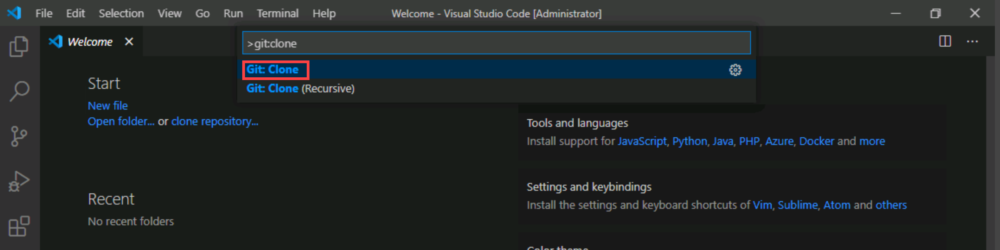
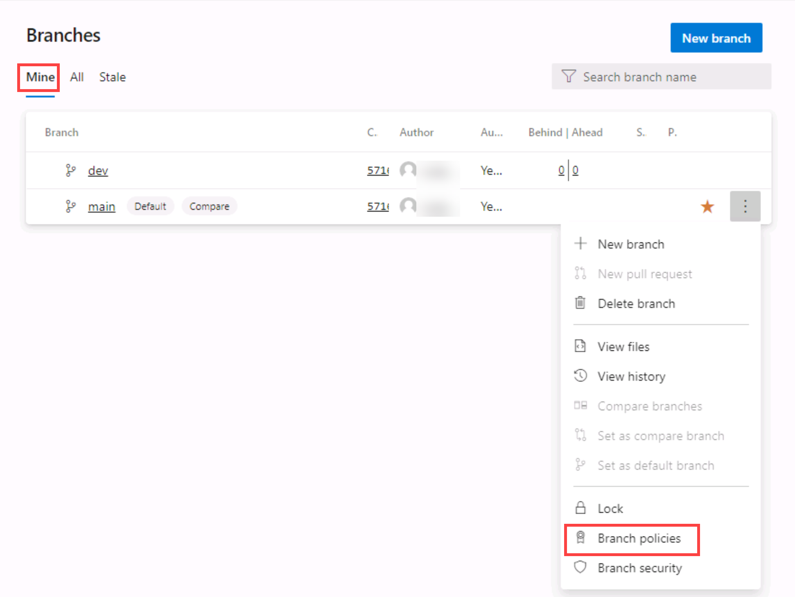
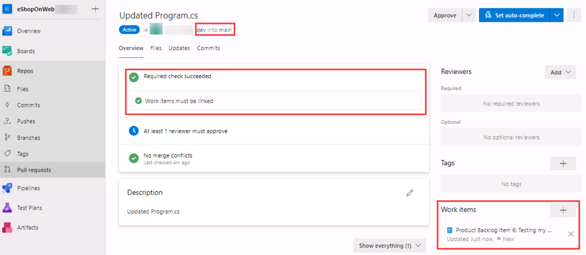

---
lab:
  title: Azure Repos の Git によるバージョン管理
  module: 'Module 02: Work with Azure Repos and GitHub'
---

# Azure Repos の Git によるバージョン管理

## 受講生用ラボ マニュアル

## ラボの要件

- このラボには、**Microsoft Edge** または [Azure DevOps 対応ブラウザー](https://docs.microsoft.com/azure/devops/server/compatibility)が必要です。

- **Azure DevOps 組織を設定する:** このラボで使用できる Azure DevOps 組織がまだない場合は、[組織またはプロジェクト コレクションの作成](https://docs.microsoft.com/azure/devops/organizations/accounts/create-organization)に関するページの手順に従って作成してください。

- Git 2.29.2 以降をまだインストールしていない場合は、Web ブラウザーを起動し、[Git for Windows のダウンロード ページ](https://gitforwindows.org/)に移動してダウンロードし、インストールします。
- Visual Studio Code をまだインストールしていない場合は、Web ブラウザー ウィンドウから [Visual Studio Code ダウンロード ページ](https://code.visualstudio.com/)に移動し、ダウンロードしてインストールします。
- Visual Studio C# 拡張機能をまだインストールしていない場合は、Web ブラウザー ウィンドウで、[C# 拡張機能のインストール ページ](https://marketplace.visualstudio.com/items?itemName=ms-dotnettools.csharp)に移動してインストールします。

## ラボの概要

Azure DevOps は、Git と Team Foundation バージョン管理 (TFVC) の 2 種類のバージョン管理をサポートしています。 2 つのバージョン管理システムの概要は次のとおりです。

- **Team Foundation バージョン管理 (TFVC)** :TFVC は集中型バージョン管理システムです。 通常、チーム メンバーの開発用コンピューターには、各ファイルの 1 つのバージョンだけが存在します。 履歴データはサーバーにのみ保持されます。 分岐はパスに基づき、サーバー上で作成されます。

- **Git**:Git は分散型バージョン管理システムです。 Git リポジトリはローカルに存在させることができます (開発者のマシン上)。 各開発者は、開発マシンにソース リポジトリのコピーを持っています。 開発者は、ネットワーク接続がなくても開発用コンピューター上で変更セットをコミットし、履歴の表示や比較などのバージョン管理操作を実行できます。

Git は、新しいプロジェクトの既定のバージョン管理プロバイダーです。 TFVC で集中型バージョン管理機能が必要な場合を除いて、プロジェクトのバージョン管理には Git を使用する必要があります。

このラボでは、Azure DevOps の集中型 Git リポジトリと簡単に同期できるローカル Git リポジトリを確立する方法を学びます。 さらに、Git のブランチとマージのサポートについても学びます。 Visual Studio Code を使用しますが、Git 互換クライアントの使用にも同じプロセスが適用されます。

## 目標

このラボを完了すると、次のことができるようになります。

- 既存のリポジトリをクローンする
- コミットして作業を保存する
- 変更履歴をレビューする
- Visual Studio Code を使用してブランチを操作する

## 推定時間:60 分

## Instructions

### 演習 0:ラボの前提条件の構成

この演習では、ラボの前提条件を設定します。これは、[eShopOnWeb](https://github.com/MicrosoftLearning/eShopOnWeb) に基づくリポジトリを含む新しい Azure DevOps プロジェクトで構成されます。

#### タスク 1: (完了している場合はスキップしてください) チーム プロジェクトを作成して構成する

このタスクでは、複数のラボで使用される **eShopOnWeb** Azure DevOps プロジェクトを作成します。

1. ラボ コンピューターのブラウザー ウィンドウで、Azure DevOps 組織を開きます。 **[新しいプロジェクト]** をクリックします。 プロジェクトに **eShopOnWeb** という名前を付け、 **[作業項目プロセス]** ドロップダウンで **[スクラム]** を選びます。 **[作成]** をクリックします。

    

#### タスク 2: (完了している場合はスキップしてください) eShopOnWeb Git リポジトリをインポートする

このタスクでは、複数のラボで使用される eShopOnWeb Git リポジトリをインポートします。

1. ラボ コンピューターのブラウザー ウィンドウで、Azure DevOps 組織と、前に作成した **eShopOnWeb** プロジェクトを開きます。 **[リポジトリ] > [ファイル]** 、 **[インポート]** をクリックします。 **[Git リポジトリをインポートする]** ウィンドウで、URL https://github.com/MicrosoftLearning/eShopOnWeb.git を貼り付けて、 **[インポート]** をクリックします。

    

2. リポジトリは次のように編成されています。
    - **.ado** フォルダーには、Azure DevOps の YAML パイプラインが含まれています
    - **.devcontainer** フォルダーには、コンテナーを使って開発するためのセットアップが含まれています (VS Code でローカルに、または GitHub Codespaces で)
    - **.azure** フォルダーには、一部のラボ シナリオで使用される Bicep&ARM コードとしてのインフラストラクチャ テンプレートが含まれています。
    - **.github** フォルダーには、YAML GitHub ワークフローの定義が含まれています。
    - **src** フォルダーには、ラボ シナリオで使用される .NET 6 Web サイトが含まれています。

#### タスク 3: Git と Visual Studio Code を構成する

このタスクでは、Git および Visual Studio Code をインストールおよび構成します。これには、Azure DevOps との通信に使用される Git 資格情報を安全に保存するための Git 資格情報ヘルパーの構成も含まれます。 これらの前提条件をすでに実装している場合は、次のタスクに直接進むことができます。

1. ラボ コンピューターで、**Visual Studio Code** を開きます。
2. Visual Studio Code のインターフェイスのメイン メニューで、 **[ターミナル \| 新しいターミナル]** を選択して、 **[ターミナル]**  ペインを開きます。
3. **[ターミナル]** ペインの右上隅にあるドロップダウン リストに **1: powershell** が表示されているかどうかを確認して、現在のターミナルが **PowerShell** を実行していることを確認します

    > **注**: 現在のターミナル シェルを **PowerShell** に変更するには、**[ターミナル]** ペインの右上隅のドロップダウン リストをクリックし、**[既定のシェルの選択]** をクリックします。 Visual Studio Code ウィンドウの上部で、使用するターミナル シェル **Windows PowerShell** を選択し、ドロップダウン リストの右側にあるプラス記号をクリックして、選択したデフォルト シェルで新しいターミナルを開きます。

4. **[ターミナル]** ペインで、以下のコマンドを実行して、資格情報ヘルパーを構成します。

    ```git
    git config --global credential.helper wincred
    ```

5. **[ターミナル]** ペインで、次のコマンドを実行して、Git コミットのユーザー名とメールアドレスを設定します (中括弧内のプレースホルダーをユーザー名とメールアドレスに置き換えます。< 記号と > 記号は排除します)。

    ```git
    git config --global user.name "<John Doe>"
    git config --global user.email <johndoe@example.com>
    ```

### 演習 1:既存のリポジトリを複製する

この演習では、Visual Studio Code を使用して、前の演習の一部としてプロビジョニングした Git リポジトリのクローンを作成します。

#### タスク 1:既存のリポジトリを複製する

このタスクでは、Visual Studio Code を使用して Git リポジトリを複製するプロセスを順を追って説明します。

1. Azure DevOps 組織と前の演習で生成した **eShopOnWeb** プロジェクトを表示する Web ブラウザーに切り替えます。
2. Azure DevOps ポータルの垂直ナビゲーション ペインで、**[リポジトリ]** アイコンを選択します。

3. **eShopOnWeb** リポジトリ ペインの右上隅にある **[クローン]** をクリックします。

    

    > **注**:Git リポジトリのローカル コピーを取得することを*クローン作成*と呼びます。 すべての主流の開発ツールはこれをサポートしており、Azure Repos に接続して、最新のソースをプル ダウンして操作できるようになります。

4. **[リポジトリのクローン]** パネルで、**[HTTPS]** コマンドライン オプションを選択した状態で、リポジトリ クローン URL の横にある **[クリップボードにコピー]** ボタンをクリックします。

    > **注**:この URL を Git 互換ツールで使用して、コードベースのコピーを取得できます。

5. **[リポジトリのクローン]** パネルを閉じます。
6. ラボ コンピューターで実行されている **Visual Studio Code** に切り替えます。
7. **[表示]** メニューヘ ッダーをクリックし、ドロップダウン メニューで **[コマンド パレット]** をクリックします。

    > **注**:コマンド パレットは、サードパーティの拡張機能として実装されているタスクを含む、さまざまなタスクにアクセスするための簡単で便利な方法を提供します。 キーボード ショートカットの **Ctrl+Shift+P** または **F1** を使用して開くことができます。

8. コマンド パレット プロンプトで、**Git:Clone** コマンドを実行します。

    

    > **注**:関連するすべてのコマンドを表示するには、**Git** と入力することから始めます。

9. **[リポジトリ URL を提供するか、リポジト リソースを選択する]** テキストボックスで、このタスクの前半でコピーしたリポジトリ クローン URL を貼り付け、**Enter** キーを押します。
10. 「**フォルダーの選択**」ダイアログ ボックスで、C: ドライブに移動し、**Git** という名前の新しいフォルダーを作成して選択し、「**リポジトリの場所の選択**」をクリックします。
11. プロンプトが表示されたら、Azure DevOps アカウントにログインします。
12. クローン作成プロセスが完了した後、プロンプトが表示されたら、Visual Studio Code で **[開く]** をクリックして、クローンされたリポジトリを開きます。

    > **注**:プロジェクトのロードに関する問題に関して受け取る可能性のある警告は無視してかまいません。 ソリューションはビルドに適した状態ではない可能性がありますが、Git での作業に重点を置くため、プロジェクトのビルドは必要ありません。

### 演習 2:コミットで作業を保存する

この演習では、Visual Studio Code を使用して変更をステージングおよびコミットすることを含むいくつかのシナリオを順を追って説明します。

ファイルに変更を加えると、Git はその変更をローカル リポジトリに記録します。 ステージングすることにより、コミットする変更を選択できます。 コミットは常にローカル Git リポジトリに対して行われるため、コミットが完全であるか、他のユーザーと共有する準備ができているかを心配する必要はありません。 作業を続けながらコミットを増やし、共有の準備ができたら変更を他の人にプッシュできます。

Git コミットは、次のもので構成されます。

- コミットで変更されたファイル。 Git は、リポジトリ内のすべてのファイル変更の内容をコミットに保持します。 これにより、高速が維持され、インテリジェントなマージが可能になります。
- 親コミットへの参照。 Git は、これらの参照を使用してコード履歴を管理します。
- コミットを説明するメッセージ。 コミットを作成するときに、このメッセージを Git に渡します。 このメッセージを説明的なものにしておくことをお勧めしますが、要点を説明します。

#### タスク 1:変更をコミットする

このタスクでは、Visual Studio Code を使用して変更をコミットします。

1. Visual Studio Code ウィンドウの縦型ツール バーの上部にある **[エクスプローラー]** タブを選び、 **/eShopOnWeb/src/Web/Program.cs** ファイルに移動して選びます。 これにより、コンテンツが詳細ペインに自動的に表示されます。
2. 最初の行に次のコメントを追加します。

    ```csharp
    // My first change
    ```

    > **注**:コメントが何であるかは実際には問題ではありません。目標は、変更を加えることだけです。

3. **Ctrl + S** キーを押して、変更を保存します。
4. Visual Studio Code ウィンドウで、**[ソース管理]** タブを選択して、Git が Git リポジトリのローカル クローンにあるファイルへの最新の変更を認識したことを確認します。
5. ペインの上部にあるテキスト ボックスの **[ソース管理]** タブを選択した状態で、コミット メッセージとして「**マイコミット**」と入力し、**Ctrl + Enter** キーを押してローカルでコミットします。

    

6. 変更を自動的にステージングして直接コミットするかどうかを確認するメッセージが表示されたら、**[常に]** をクリックします。

    > **注**:**ステージング**については、ラボの後半で説明します。

7. Visual Studio Code ウィンドウの左下隅の **main** ラベルの右側にある、反対方向を指す 2 本の縦矢印と、上向きの矢印の横にある番号 **1** が付いた円の **[変更の同期]** アイコンに注意してください。 アイコンをクリックし、プロンプトが表示されたら、続行するかどうかを選び、 **[OK]** をクリックして、**origin/main** との間でコミットをプッシュおよびプルします。

#### タスク 2:コミットの確認

このタスクでは、Azure DevOps ポータルを使用してコミットを確認します。

1. Azure DevOps インターフェイスを表示する Web ブラウザー ウィンドウに切り替えます。
2. Azure DevOps ポータルの垂直ナビゲーション ペインの **[リポジトリ]** セクションで、 **[コミット]** を選択します。
3. コミットがリストの一番上に表示されることを確認します。

    

#### タスク 3:ステージの変更

このタスクでは、Visual Studio Codeを 使用してステージングの変更の使用方法を検討します。 ステージングの変更により、他のファイルで行われた変更を渡しながら、特定のファイルを選択的にコミットに追加できます。

1. **[Visual Studio Code]** ウィンドウに切り替えます。
2. 開いている **Program.cs** クラスを更新して最初のコメントを次の内容に変更し、ファイルを保存します。

    ```csharp
        //My second change
    ```

3. Visual Studio Code ウィンドウで **[エクスプローラー]** タブに戻り、 **/eShopOnWeb/src/Web/Constants.cs** ファイルに移動して選びます。 これにより、コンテンツが詳細ペインに自動的に表示されます。
4. **Constants.cs** ファイルの 1 行目にコメントを追加し、ファイルを保存します。

    ```csharp
    // My third change
    ```

5. Visual Studio Code ウィンドウで、 **[ソース管理]** タブに切り替え、**Program.cs** エントリの上にマウス ポインターを置いて、そのエントリの右側にあるプラス記号をクリックします。

    > **注**: これで **Program.cs** ファイルへの変更のみがステージングされます。**Constants.cs** なしでコミットする準備は完了です。

6. ペインの上部にある **[ソース管理]** タブを選択した状態で、テキスト ボックスに「**コミット メッセージとしてコメントを追加**」と入力します。

    

7. **[ソース管理]** タブの上部にある省略記号をクリックし、ドロップダウン メニューで **[コミット]** を選択し、カスケード メニューで **[ステージング済みをコミット]** を選択します。
8. Visual Studio Code ウィンドウの左下隅にある **[変更の同期]** ボタンをクリックしてコミット済みの変更をサーバーと同期します。続行するかどうかを確認するメッセージが表示されたら、 **[OK]** をクリックして、**origin/main** との間でコミットをプッシュおよびプルします。

    > **注**:段階的な変更のみがコミットされたため、他の変更は同期が保留されていることに注意してください。

### 演習 3:履歴の確認

この演習では、Azure DevOps ポータルを使用して、コミットの履歴を確認します。

Git は、各コミットに保存されている親参照情報を使用して、開発の完全な履歴を管理します。 このコミット履歴を簡単に確認して、ファイルの変更がいつ行われたかを確認し、ターミナルを使用して、または利用可能な多くの Visual Studio Code 拡張機能の 1 つからコードのバージョン間の違いを判断できます。 Azure DevOps ポータルを使用して変更を確認することもできます。

Git による**ブランチとマージ**機能の使用はプル要求を介して機能するため、開発のコミット履歴は必ずしも直線的な時系列を形成するとは限りません。 履歴を使用してバージョンを比較するときは、2 つの時点間のファイルの変更ではなく、2 つのコミット間のファイルの変更の観点から考えてください。 マスター ブランチのファイルに対する最近の変更は、昨日マージされた機能ブランチで 2 週間前に作成されたコミットに起因している可能性があります。

#### タスク 1:ファイルを比較する

このタスクでは、Azure DevOps ポータルを使用して、コミット履歴を順を追って説明します。

1. Visual Studio Code ウィンドウの **[ソース管理]** タブを開いた状態で、ファイルのステージングされていないバージョンを表す **Constants.cs** を選びます。

    

    > **注**:比較ビューが開かれ、行った変更を簡単に見つけることができます。 この場合、それはただ 1 つのコメントです。

2. **Azure DevOps** ポータルの **[コミット]** ペインを表示している Web ブラウザー ウィンドウに切り替えて、ソース ブランチとマージを確認します。 これらは、ソースにいつどのように変更が加えられたかを視覚化するための便利な方法を提供します。
3. **[担当のコミット]** エントリまで下にスクロールし、その上にマウス ポインターを置くと、右側に省略記号が表示されます。
4. ドロップダウン メニューで省略記号をクリックし、**[ファイルの参照]** を選択して、結果を確認します。

    

    > **注**:このビューは、コミットに対応するソースの状態を表し、各ソースファイルを確認してダウンロードできるようにします。

### 演習 4:ブランチの操作

この演習では、Visual Studio Code と Azure DevOps ポータルを使用したブランチ管理を含むシナリオを順を追って説明します。

Azure DevOps ポータルの **Azure リポジトリ**の**ブランチ** ビューから、Azure DevOps Git リポジトリを管理できます。 ビューをカスタマイズして、最も関心のあるブランチを追跡することもできるため、チームによって行われた変更を常に把握できます。

ブランチへの変更をコミットしても他のブランチには影響せず、変更をメインプロジェクトにマージしなくても、ブランチを他のブランチと共有できます。 新しいブランチを作成して、機能の変更やバグ修正をマスター ブランチやその他の作業から分離することもできます。 ブランチは軽量であるため、ブランチ間の切り替えはすばやく簡単です。 Git は、ブランチを操作するときにソースの複数のコピーを作成するのではなく、コミットに保存されている履歴情報を使用して、ブランチでの作業を開始するときにファイルを再作成します。 Git ワークフローでは、機能とバグ修正を管理するためのブランチを作成して使用する必要があります。 コードの共有やプル要求を使用したコードのレビューなど、Git ワークフローの残りの部分は、すべてブランチを介して機能します。 ブランチ内の作業を分離すると、現在のブランチを変更するだけで、作業内容を非常に簡単に変更できます。

#### タスク 1:ローカル リポジトリに新しいブランチを作成する

このタスクでは、Visual Studio Code を使用してブランチを作成します。

1. ラボ コンピューターで実行されている **Visual Studio Code** に切り替えます。
2. **[ソース管理]** タブを選択した状態で、Visual Studio Code ウィンドウの左下隅にある **main** をクリックします。
3. ポップアップ ウィンドウで、**[+ ... から新しいブランチを作成する]** を選択します。

    

4. **[ブランチ名]** テキスト ボックスに「**dev**」と入力して新しいブランチを指定し、**Enter** キーを押します。
5. **[Select a ref to create the 'dev' branch from] (参照を選択してテキストボックスから 'dev' ブランチを作成する)** テキストボックスで、参照ブランチとして **main** を選びます。

    > **注**:この時点で、自動的に **dev** ブランチに切り替わります。

#### タスク 2: ブランチを削除する

このタスクでは、Visual Studio Code を使用して、前のタスクで作成したブランチを操作します。

Git は、作業中のブランチを追跡し、ブランチをチェックアウトするときに、ファイルがそのブランチでの最新のコミットと一致することを確認します。 ブランチを使用すると、同じローカル Git リポジトリ内の複数のバージョンのソース コードを同時に操作できます。 Visual Studio Code を使用して、ブランチを公開、チェックアウト、および削除できます。

1. **Visual Studio Code** ウィンドウで、**[ソース管理]** タブを選択した状態で、Visual Studio Code ウィンドウの左下隅にある **[変更の公開]** アイコン (新しく作成したブランチを表す **dev** ラベルのすぐ右側) をクリックします。
2. **Azure DevOps** ポータルの **[コミット]** ペインを表示している Web ブラウザーウィンドウに切り替えて、**[ブランチ]** を選択します。
3. **[ブランチ]** ペインの **[マイニング]** タブで、ブランチのリストに **dev** が含まれていることを確認します。
4. マウス ポインタを **dev** ブランチ エントリに合わせると、右側に省略記号が表示されます。
5. 省略記号をクリックし、ポップアップ メニューで **[ブランチの削除]** を選択し、確認を求められたら **[削除]** をクリックします。

    

6. **Visual Studio Code** ウィンドウに戻り、**[ソース管理]** タブを選択した状態で、Visual Studio Code ウィンドウの左下隅にある **dev** エントリをクリックします。 これにより、Visual Studio Code ウィンドウの上部に既存のブランチが表示されます。
7. 2 つの **dev** ブランチがリストされていることを確認します。

    > **注**:ローカル (**dev**) ブランチは、リモート リポジトリ内のブランチの削除によってその存在が影響を受けないため、リストされています。 サーバー (**origin/dev**) は、プルーニングされていないため、リストされています。

8. ブランチのリストで、**main** ブランチを選んでチェックアウトします。
9. **Ctrl+Shift+P** を押して、**コマンド パレット**を開きます。
10. **[コマンド パレット]** プロンプトで「**Git:Delete**」と入力し、表示されたら **[Git:Delete Branch]** を選択します。
11. 削除するブランチのリストから **dev** エントリを選択します。
12. Visual Studio Code ウィンドウの左下隅にある **main** エントリをもう一度クリックします。 これにより、Visual Studio Code ウィンドウの上部に既存のブランチが表示されます。
13. ローカル **dev** ブランチがリストに表示されなくなっているが、リモート **origin/dev** がまだ存在していることを確認します。
14. **Ctrl+Shift+P** を押して、**コマンド パレット**を開きます。
15. **[コマンド パレット]** プロンプトで「**Git: Fetch**」と入力し、表示されたら **[Git: Fetch (Prune)]** を選択します。

    > **注**:このコマンドは、ローカル スナップショットの元のブランチを更新し、存在しなくなったブランチを削除します。

    > **注**: Visual Studio Code ウィンドウの右下にある **[出力]** ウィンドウを選択すると、これらのタスクが実行していることを正確に確認できます。 出力コンソールに Git ログが表示されない場合は、ソースとして **Git** を選択してください。

16. Visual Studio Code ウィンドウの左下隅にある **main** エントリをもう一度クリックします。
17. **origin/dev** ブランチがブランチのリストに表示されなくなったことを確認します。

#### タスク 3: ブランチを復元する

このタスクでは、Azure DevOps ポータルを使用して、前のタスクで削除したブランチを復元します。

1. Azure DevOps ポータルの **[ブランチ]** ペインの **[マイニング]** タブを表示している Web ブラウザーに切り替えます。
2. **[ブランチ]** ペインの **[マイニング]** タブで、 **[すべて]** タブを選択します。
3. **[ブランチ]** ペインの **[すべて]** タブの **[ブランチ名の検索]** テキスト ボックスに「**dev**」と入力します。
4. 新しく削除されたブランチを表すエントリを含む **[削除されたブランチ]** セクションを確認します。
5. **[削除されたブランチ]** セクションで、マウス ポインターを **dev** ブランチ エントリに合わせると、右側に省略記号が表示されます。
6. ポップアップ メニューで省略記号をクリックし、 **[ブランチを復元]** を選択します。

    

    > **注**:正確な名前がわかっている限り、この機能を使用して、削除されたブランチを復元できます。

#### タスク 4: ブランチ ポリシー

このタスクでは、Azure DevOps ポータルを使って、main ブランチにポリシーを追加し、定義済みのポリシーに準拠する pull request を使った変更のみを許可します。 ブランチの変更を確認してから、マージする必要があります。

わかりやすくするために、(元のシナリオで推奨されていたように) VS コードでローカル クローンを使うのではなく、Web ブラウザーのリポジトリ エディターで直接作業します (origin で直接作業します)。

1. Azure DevOps ポータルの **[ブランチ]** ペインの **[マイニング]** タブを表示している Web ブラウザーに切り替えます。
2. **[ブランチ]** ペインの **[マイニング]** タブで、**main** ブランチ エントリにマウス ポインターを合わせると、右側に省略記号が表示されます。
3. 省略記号をクリックし、ポップアップ メニューで **[ブランチ ポリシー]** を選びます。

    

4. リポジトリ設定の **[main]** タブで、 **[Require minimum number of reviewers] (レビュー担当者の最小数を必須にする)** のオプションを有効にします。 **1** 人のレビュー担当者を追加し、 **[Allow requestors to approve their own changes] (要求者が自分の変更を承認することを許可する)** チェック ボックスをオンにします (このラボのプロジェクトでは、自分が唯一のユーザーであるため)
5. リポジトリ設定の **[main]** タブで、 **[Check for linked work items] (リンクされた作業項目を確認する)** のオプションを有効にし、 **[必要]** オプションのままにします。

    

#### タスク 5: ブランチ ポリシーのテスト

このタスクでは、Azure DevOps ポータルを使ってポリシーをテストし、最初の pull request を作成します。

1. Azure DevOps ポータルの縦型ナビゲーション ペインで、 **[リポジトリ] > [ファイル]** の **main** ブランチが選ばれていることを確認します (表示コンテンツの上のドロップダウン)。
2. ポリシーが機能していることを確認するには、**main** ブランチに変更を加えてコミットし、 **/eShopOnWeb/src/Web/Program.cs** ファイルに移動して選びます。 これにより、コンテンツが詳細ペインに自動的に表示されます。
3. 最初の行に次のコメントを追加します。

    ```csharp
    // Testing main branch policy
    ```

4. **[コミット] > [コミット]** をクリックします。 "changes to the main branch can only be done using a Pull Request" (main ブランチを変更するには pull request を使用する必要があります) という警告が表示されます。

    

5. **[キャンセル]** をクリックしてコミットをスキップします。

#### タスク 6: pull request の操作

このタスクでは、**dev** ブランチを使って、保護された **main** ブランチに変更をマージする pull request を、Azure DevOps ポータルを使って作成します。 コード アクティビティで保留中の作業を追跡できるように、Azure DevOps の作業項目は変更にリンクされています。

1. Azure DevOps ポータルの縦型ナビゲーション ペインの **[ボード]** セクションにある **[作業項目]** を選びます。
2. **[+ 新しい作業項目] > [プロダクト バックログ項目]** をクリックします。 タイトル フィールドに「**最初の PR のテスト**」と入力し、 **[保存]** をクリックします。
3. Azure DevOps ポータルの縦型ナビゲーション ペインに戻り、 **[リポジトリ] > [ファイル]** で **dev** ブランチが選ばれていることを確認します。
4. **/eShopOnWeb/src/Web/Program.cs** ファイルに移動し、最初の行に次の変更を加えます。

    ```csharp
    // Testing my first PR
    ```

5. **[コミット] > [コミット]** をクリックします (既定のコミット メッセージのままにします)。 今回はコミットが機能し、**dev** ブランチにポリシーはありません。
6. メッセージがポップアップ表示され、pull request を作成するように提案されます (**dev** ブランチは **main** と比較して変更が進んでいるため)。 **[Pull request の作成]** をクリックします。

    

7. **[新しい Pull Request]** タブで、既定のまま **[作成]** をクリックします。
8. pull request には、ターゲットの **main** ブランチに適用されているポリシーに基づいて、失敗した、または保留中の要求がいくつか表示されます。
    - 提案される変更には、おそらく作業項目がリンクされています
    - 少なくとも 1 人のユーザーが変更を確認し、承認する必要があります。

9. 右側のオプションにある **[作業項目]** の横の **+** ボタンをクリックします。 先ほど作成した作業項目をクリックして、pull request にリンクします。 要件の 1 つの状態が変わったことを確認できます。

    

10. 次に、 **[ファイル]** タブを開いて、提案された変更を確認します。 より完全な pull request では、ファイルを 1 つずつ確認し (レビュー済みとマーク)、明確でない行に対してコメントを開くことができます (行番号にマウスを置くと、コメントを投稿するオプションが表示されます)。
11. **[概要]** タブに戻り、右上隅の **[承認]** をクリックします。 すべての要件が緑色に変わります。 これで **[完了]** をクリックできます。
12. **[プル要求の完了]** タブでは、マージを完了する前に複数のオプションが表示されます。
    - **マージの種類**: 4 つのマージの種類があります。[ここ](https://learn.microsoft.com/azure/devops/repos/git/complete-pull-requests?view=azure-devops&tabs=browser#complete-a-pull-request)を確認するか、用意されているアニメーションを見ることができます。 **[マージ (早送りなし)]** を選びます。
    - **完了後のオプション**:
        - **[関連付けられた作業項目をマージ後に完了する]** をオンにします。これで、関連付けられた PBI が "**完了**" 状態になります。

13. **[マージの完了]** をクリックします

#### タスク 7: タグの適用

製品チームは、サイトの現在のバージョンを v1.1.0-beta としてリリースすることを決定しました。

1. Azure DevOps ポータルの垂直ナビゲーション ペインの **[リポジトリ]** セクションで、 **[タグ]** を選択します。
2. **[タグ]** ペインで、 **[新しいタグ]** をクリックします。
3. **[タグの作成]** パネルの **[名前]** テキストボックスに「**v1.1.0-beta**」と入力し、 **[ベース]** ドロップダウン リストで **main** エントリを選択したままにし、 **[説明]** テキスト ボックスに「**ベータ リリース v1.1.0**」と入力して **[作成]** をクリックします。

    > **注**: このリリースのリポジトリにタグを付ける作業はこれで完了です (最新のコミットがタグにリンクされます)。 さまざまな理由でコミットにタグを付けることができます。Azure DevOps は、コミットを編集および削除したり、アクセス許可を管理したりする柔軟性を提供します。

## 確認

このラボでは、Azure DevOps ポータルを使用してブランチとリポジトリを管理しました。
