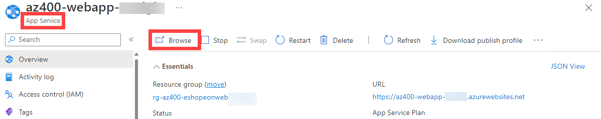

---
lab:
  title: CI/CD のために GitHub Actions を実装する
  module: 'Module 02: Implement CI with Azure Pipelines and GitHub Actions'
---

# CI/CD のために GitHub Actions を実装する

## 受講生用ラボ マニュアル

## ラボの要件

- このラボには、**Microsoft Edge** または [Azure DevOps 対応ブラウザー](https://docs.microsoft.com/azure/devops/server/compatibility)が必要です。

- 既存の Azure サブスクリプションを識別するか、新しいものを作成します。

- Azure サブスクリプションで共同作成者または所有者のロールを持つ Microsoft アカウントまたは Microsoft Entra アカウントを持っていることを確認します。 詳細については、[「Azure portal を使用して Azure ロールの割り当てを一覧表示する」](https://docs.microsoft.com/azure/role-based-access-control/role-assignments-list-portal)および[「Azure Active Directory で管理者ロールを表示して割当てる」](https://docs.microsoft.com/azure/active-directory/roles/manage-roles-portal)を参照してください。

- このラボで使用できる **GitHub アカウントをまだお持ちでない場合**は、[新しい GitHub アカウントのサインアップ](https://github.com/join)にある手順に従ってアカウントを作成してください。

## ラボの概要

このラボでは、Azure Web アプリをデプロイする GitHub Actions ワークフローを実装する方法を学習します。

## 目標

このラボを完了すると、次のことができるようになります。

- CI/CD のために GitHub Actions ワークフローを実装する。
- GitHub Actions ワークフローの基本的な特性について説明する。

## 推定時間:40 分

## Instructions

### 演習 0: eShopOnWeb を GitHub リポジトリにインポートする

この演習では、既存の [eShopOnWeb](https://github.com/MicrosoftLearning/eShopOnWeb) リポジトリのコードを独自の GitHub プライベート リポジトリにインポートします。

リポジトリは次のように編成されています。
- **.ado** フォルダーには、Azure DevOps の YAML パイプラインが含まれています。
- **.devcontainer** フォルダーには、コンテナーを使って開発するためのセットアップが含まれています (VS Code でローカルに、または GitHub Codespaces で)。
- **infra** フォルダーには、一部のラボ シナリオで使用される Bicep および ARM のコードとしてのインフラストラクチャ テンプレートが含まれています。
- **.github** フォルダーには、YAML GitHub ワークフローの定義が含まれています。
- **src** フォルダーには、ラボ シナリオで使用される .NET 8 Web サイトが含まれています。

#### タスク 1: GitHub でパブリック リポジトリを作成し、eShopOnWeb をインポートする

このタスクでは、空のパブリック GitHub リポジトリを作成し、既存の [eShopOnWeb](https://github.com/MicrosoftLearning/eShopOnWeb) リポジトリをインポートします。

1. ラボ コンピューターから Web ブラウザーを起動し、[GitHub Web サイト](https://github.com/)に移動し、ご自分のアカウントを使ってサインインし、 **[New]** をクリックして新しいリポジトリを作成します。

    

1. **[Create a new repository]** ページで、 **[Import a repository]** のリンク (ページ タイトルの下) をクリックします。

    > 注: インポート Web サイトは、 <https://github.com/new/import> で直接開くこともできます。

1. **[Import your project to GitHub]** ページ上で:

    | フィールド | 値 |
    | --- | --- |
    | 古いリポジトリのクローン URL| <https://github.com/MicrosoftLearning/eShopOnWeb> |
    | 所有者 | アカウントの別名 |
    | リポジトリ名 | eShopOnWeb |
    | プライバシー | **Public** |

1. **[Begin Import]** をクリックし、リポジトリの準備が整うのを待ちます。

1. リポジトリ ページで、 **[Settings]** に移動し、 **[Actions] > [General]** をクリックし、 **[Allow all actions and reusable workflows]** オプションを選択します。 **[Save]** をクリックします。

    

### 演習 1: GitHub リポジトリと Azure アクセスを設定する

この演習では、GitHub Actions から Azure サブスクリプションにアクセスする GitHub を承認するための Azure サービス プリンシパルを作成します。 また、Web サイトをビルド、テストし、Azure にデプロイする GitHub ワークフローも設定します。

#### タスク 1: Azure サービス プリンシパルを作成し、GitHub シークレットとして保存する

このタスクでは、GitHub が目的のリソースをデプロイするために使用する Azure サービス プリンシパルを作成します。 代わりに、シークレットレス認証メカニズムとして [Azure の OpenID Connect](https://docs.github.com/actions/deployment/security-hardening-your-deployments/configuring-openid-connect-in-azure) を使用することもできます。

1. ラボ コンピューターのブラウザー ウィンドウで、Azure Portal (https://portal.azure.com/) を開きます。
1. ポータルで、 **[リソース グループ]** を探してクリックします。
1. **[+ 作成]** をクリックして、演習用の新しいリソース グループを作成します。
1. **[リソース グループを作成します]** タブで、リソース グループに **rg-eshoponweb-NAME** という名前を付けます (NAME を一意の別名に置き換えてください)。 **[確認と作成] > [作成]** をクリックします。
1. Azure Portal で、(検索バーの横にある) **Cloud Shell** を開きます。

    > 注: Cloud Shell を初めて開く場合は、[永続ストレージ](https://learn.microsoft.com/azure/cloud-shell/persisting-shell-storage)を構成する必要があります

1. ターミナルが **Bash** モードで実行されていることを確認し、次のコマンドを実行します。**SUBSCRIPTION-ID** と **RESOURCE-GROUP** を独自の識別子に置き換えてください (どちらも [リソース グループ] の **[概要]** ページで確認できます)。

    `az ad sp create-for-rbac --name GH-Action-eshoponweb --role contributor --scopes /subscriptions/SUBSCRIPTION-ID/resourceGroups/RESOURCE-GROUP --sdk-auth`

    > 注: これが 1 行として入力されるか貼り付けられていることを確認します。
    > 注: このコマンドを実行すると、前に作成したリソース グループへの共同作成者アクセス権を持つサービス プリンシパルが作成されます。 これにより、GitHub Actions には、このリソース グループと対話するために必要なアクセス許可のみが付与されます (サブスクリプションの残りの部分は含まれません)

1. コマンドによって JSON オブジェクトが出力されます。後でそれをワークフローの GitHub シークレットとして使います。 その JSON をコピーしておきます。 この JSON には、Microsoft Entra ID (サービス プリンシパル) の名前で Azure に対する認証に使用される識別子が含まれます。

    ```JSON
        {
            "clientId": "<GUID>",
            "clientSecret": "<GUID>",
            "subscriptionId": "<GUID>",
            "tenantId": "<GUID>",
            (...)
        }
    ```

1. また、次のコマンドを実行して、後でデプロイする **Azure App Service** のリソース プロバイダーを登録する必要もあります。

   ```bash
   az provider register --namespace Microsoft.Web
   ```

1. ブラウザー ウィンドウで、**eShopOnWeb** GitHub リポジトリに戻ります。
1. リポジトリ ページで **[Settings] (設定)** に移動し、 **[Secrets and variables] (シークレットと変数) > [Actions] (アクション)** をクリックします。 **[New repository secret]** をクリックします
    - 名前 : **AZURE_CREDENTIALS**
    - シークレット: **前にコピーした JSON オブジェクトを貼り付けます** (GitHub では、[azure/login](https://github.com/Azure/login) アクションで使用される複数のシークレットを同じ名前で保持できます)

1. **[Add secret]** をクリックします。 これで、GitHub Actions ではリポジトリ シークレットを使用して、サービス プリンシパルを参照できるようになりました。

#### タスク 2: GitHub ワークフローを変更して実行する

このタスクでは、指定された GitHub ワークフローを変更し、それを実行して独自のサブスクリプションにソリューションをデプロイします。

1. ブラウザー ウィンドウで、**eShopOnWeb** GitHub リポジトリに戻ります。
1. リポジトリ ページで、 **[Code]** に移動し、**eShopOnWeb/.github/workflows/eshoponweb-cicd.yml** というファイルを開きます。 このワークフローは、指定された .NET 8 Web サイト コード用の CI/CD プロセスを定義します。
1. **on** セクションのコメントを解除します ("#"を削除します)。 このワークフローはメイン ブランチへのプッシュのたびにトリガーされ、手動トリガー ("workflow_dispatch") も実行できます。
1. **env** セクションで、次の変更を行います。
    - **RESOURCE-GROUP** 変数の **NAME** を置き換えます。 これは、前の手順で作成したのと同じリソース グループである必要があります。
    - (省略可能) **LOCATION** には、最も近い [Azure リージョン](https://azure.microsoft.com/explore/global-infrastructure/geographies)を選択できます。 たとえば、"eastus"、"eastasia"、"westus" などです。
    - **SUBSCRIPTION-ID** の **YOUR-SUBS-ID** を置き換えます。
    - **WEBAPP-NAME** の **NAME** を一意の別名に置き換えます。 これは、Azure App Service を使用してグローバルに一意の Web サイトを作成するために使用されます。
1. ワークフローを注意深くお読みください。理解に役立つコメントが記載されています。

1. **[Start Commit]** をクリックします。 **[Commit Changes]** は既定値のままにします (メイン ブランチを変更)。 ワークフローが自動的に実行されます。

#### タスク 3: GitHub ワークフローの実行を確認する

このタスクでは、GitHub ワークフローの実行を確認します。

1. ブラウザー ウィンドウで、**eShopOnWeb** GitHub リポジトリに戻ります。
1. リポジトリ ページで、 **[Actions]** に移動すると、実行前のワークフロー設定が表示されます。 そのタイルをクリックします。

    

1. ワークフローが完了するまで待ちます。 **[Summary]** で、実行から保持される 2 つのワークフロー ジョブ、状態、成果物を確認できます。 各ジョブをクリックしてログを確認できます。

    

1. ブラウザー ウィンドウで、Azure portal (<https://portal.azure.com/>) に戻ります。 前に作成したリソース グループを開きます。 bicep テンプレートを使用した GitHub アクションによって、Azure App Service プランと App Service が作成されていることがわかります。 発行された Web サイトが表示され、App Service が開きます。 **[参照]** をクリックします。

    

#### (省略可能) タスク 4: GitHub 環境を使って手動承認の事前デプロイを追加する

このタスクでは、ワークフローのデプロイ ジョブで定義されているアクションを実行する前に、GitHub 環境を使って手動承認を求めます。

1. リポジトリ ページで、 **[Code]** に移動し、**eShopOnWeb/.github/workflows/eshoponweb-cicd.yml** というファイルを開きます。
1. **[デプロイ]** ジョブ セクションには、**Development** という**環境**への参照があります。 GitHub で使用される[環境](https://docs.github.com/en/actions/deployment/targeting-different-environments/using-environments-for-deployment)では、ターゲットの保護規則 (およびシークレット) が追加されます。

1. リポジトリ ページで、 **[Settings]** に移動し、 **[Environments]** を開き、 **[New environment]** をクリックします。
1. **Development** の名前を指定し、 **[Configure Environment]** をクリックします。

    > 注: **環境**の一覧に **Development** という名前の環境が既に存在する場合は、環境名をクリックしてその構成を開きます。  

1. **[Configure Development]** タブで、オプション **[Required Reviewers]** と、レビュー担当者としての GitHub アカウントをオンにします。 **[Save protection rules]** をクリックします。
1. 次に、保護規則をテストしましょう。 リポジトリ ページで、 **[Actions]** に移動し、 **[eShopOnWeb Build and Test]** ワークフローをクリックし、 **[Run workflow] > [Run workflow]** をクリックして手動で実行します。

    

1. 開始されたワークフローの実行をクリックし、**buildandtest** ジョブが完了するまで待ちます。 **deploy** ジョブに達すると、レビュー要求が表示されます。

1. **[Review deployments]** をクリックし、 **[Development]** をオンにして、 **[Approve and deploy]** をクリックします。

    

1. ワークフローは **deploy** ジョブの実行に続き、完了します。

### 演習 2:Azure ラボ リソースを削除する

この演習では、Azure Cloud Shell を使用して、このラボでプロビジョニングされた Azure リソースを削除し、不要な料金を排除します。

1. Azure portal で、**Cloud Shell** ウィンドウ内で **Bash** シェル セッションを開きます。
1. 次のコマンドを実行して、このモジュールのラボ全体で作成したすべてのリソース グループのリストを表示します。

    ```sh
    az group list --query "[?starts_with(name,'rg-eshoponweb')].name" --output tsv
    ```

1. 次のコマンドを実行して、このモジュールのラボ全体を通して作成したすべてのリソース グループを削除します。

    ```sh
    az group list --query "[?starts_with(name,'rg-eshoponweb')].[name]" --output tsv | xargs -L1 bash -c 'az group delete --name $0 --no-wait --yes'
    ```

    >**注**:コマンドは非同期に実行されるので (--nowait パラメーターで決定される)、同じ Bash セッション内ですぐに別の Azure CLI コマンドを実行できますが、リソース グループが実際に削除されるまでに数分かかります。

## 確認

このラボでは、Azure Web アプリをデプロイする GitHub アクション ワークフローを実装しました。
