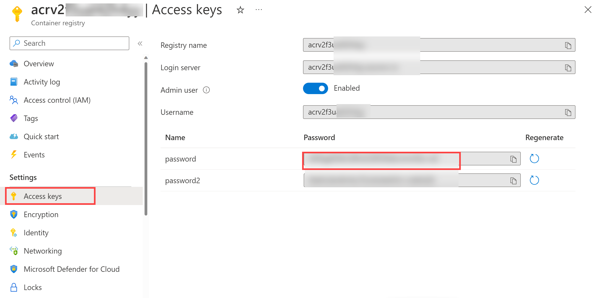

---
lab:
  title: Azure Key Vault を Azure DevOps と統合する
  module: 'Module 04: Implement a secure continuous deployment using Azure Pipelines'
---

# Azure Key Vault を Azure DevOps と統合する

## 受講生用ラボ マニュアル

## ラボの要件

- このラボには、**Microsoft Edge** または [Azure DevOps 対応ブラウザー](https://learn.microsoft.com/azure/devops/server/compatibility)が必要です。

- **Azure DevOps 組織を設定する:** このラボで使用できる Azure DevOps 組織がまだない場合は、[組織またはプロジェクト コレクションの作成](https://learn.microsoft.com/azure/devops/organizations/accounts/create-organization)に関するページの手順に従って作成してください。
- 既存の Azure サブスクリプションを識別するか、新しいものを作成します。

## ラボの概要

Azure Key Vault は、キー、パスワード、証明書などの機密データの安全な保管と管理を行います。 Azure Key Vault には、ハードウェア セキュリティ モジュールのサポートに加えて、さまざまな暗号化アルゴリズムとキーの長さが含まれています。 Azure Key Vault を使用することで、開発者がよく犯す間違いであるソース コードを介して機密データを開示する可能性を最小限に抑えることができます。 Azure Key Vault にアクセスするには、コンテンツに対するきめ細かいアクセス許可をサポートする適切な認証と承認が必要です。

このラボでは、次の手順を使用して、Azure Key Vault を Azure Pipelines と統合する方法について説明します。

- ACR のパスワードをシークレットとして保存する Azure Key Vault を作成します。
- Azure Key Vault 内のシークレットへのアクセスを提供する Azure サービス プリンシパルを作成します。
- サービス プリンシパルがシークレットを読み取れるようにするアクセス許可を構成します。
- Azure Key Vault からパスワードを取得し、それを後続のタスクに渡すようにパイプラインを構成します。

## 目標

このラボを完了すると、次のことができるようになります。

- Microsoft Entra サービス プリンシパルを作成します。
- Azure Key Vault を作成します。

## 推定時間:40 分

## Instructions

### 演習 0:ラボの前提条件の構成

この演習では、ラボの前提条件を設定します。これは、[eShopOnWeb](https://github.com/MicrosoftLearning/eShopOnWeb) に基づくリポジトリを含む新しい Azure DevOps プロジェクトで構成されます。

#### タスク 1: (完了している場合はスキップしてください) チーム プロジェクトを作成して構成する

このタスクでは、複数のラボで使用される **eShopOnWeb** Azure DevOps プロジェクトを作成します。

1. ラボ コンピューターのブラウザー ウィンドウで、Azure DevOps 組織を開きます。 **[新しいプロジェクト]** をクリックします。 プロジェクトに「**eShopOnWeb**」という名前を付け、他のフィールドは既定値のままにします。 **[作成]** をクリックします。

    

#### タスク 2: (完了している場合はスキップしてください) eShopOnWeb Git リポジトリをインポートする

このタスクでは、複数のラボで使用される eShopOnWeb Git リポジトリをインポートします。

1. ラボ コンピューターのブラウザー ウィンドウで、Azure DevOps 組織と、前に作成した **eShopOnWeb** プロジェクトを開きます。 **[リポジトリ] > [ファイル]** 、 **[インポート]** をクリックします。 **[Git リポジトリをインポートする]** ウィンドウで、URL https://github.com/MicrosoftLearning/eShopOnWeb.git を貼り付けて、 **[インポート]** をクリックします。

    

1. リポジトリは次のように編成されています。
    - **.ado** フォルダーには、Azure DevOps の YAML パイプラインが含まれています。
    - **.devcontainer** フォルダーには、コンテナーを使って開発するためのセットアップが含まれています (VS Code でローカルに、または GitHub Codespaces で)。
    - **infra** フォルダーには、一部のラボ シナリオで使用される Bicep および ARM のコードとしてのインフラストラクチャ テンプレートが含まれています。
    - **.github** フォルダーには、YAML GitHub ワークフローの定義が含まれています。
    - **src** フォルダーには、ラボ シナリオで使用される .NET 8 Web サイトが含まれています。

### 演習 1: CI パイプラインを設定して eShopOnWeb コンテナーをビルドする

次のために CI YAML パイプラインを設定します。

- コンテナー イメージを保持するための Azure コンテナー レジストリを作成する
- Docker Compose を使って **eshoppublicapi** と **eshopwebmvc** のコンテナー イメージをビルドしてプッシュする。 **eshopwebmvc** コンテナーのみがデプロイされます。

#### タスク 1: (完了している場合はスキップしてください) サービス プリンシパルを作成する

このタスクでは、Azure CLI を使ってサービス プリンシパルを作成します。これにより、Azure DevOps で次のことができるようになります。

- Azure サブスクリプションでリソースをデプロイします。
- 後で作成する Key Vault シークレットに対する読み取りアクセス権を取得する。

> **注**: サービス プリンシパルが既にある場合は、次のタスクに直接進むことができます。

Azure Pipelines から Azure リソースをデプロイするには、サービス プリンシパルが必要です。 パイプラインでシークレットを取得するため、Azure キー コンテナーを作成するときにサービスにアクセス許可を付与する必要があります。

サービス プリンシパルは、パイプライン定義内から Azure サブスクリプションに接続するとき、またはプロジェクト設定ページから新しいサービス接続を作成するときに (自動オプション)、Azure Pipelines によって自動的に作成されます。 ポータルから、または Azure CLI を使用してサービス プリンシパルを手動で作成し、プロジェクト間で再利用することもできます。

1. ラボのコンピューターで Web ブラウザーを起動し、[**Azure portal**](https://portal.azure.com) に移動します。このラボで使用する Azure サブスクリプションで、所有者のロールがあり、このサブスクリプションに関連付けられている Microsoft Entra テナントで全体管理者のロールがあるユーザー アカウントを使ってサインインします。
1. Azure portal で、ページ上部の検索テキストボックスのすぐ右側にある **Cloud Shell** アイコンをクリックします。
1. **Bash** または **PowerShell** の選択を求めるメッセージが表示されたら、**[Bash]** を選択します。

   >**注**: **Cloud Shell** を初めて起動し、[**ストレージがマウントされていません**] というメッセージが表示された場合は、このラボで使用しているサブスクリプションを選択し、**[ストレージの作成]** を選択します。

1. **Bash** プロンプトの **[Cloud Shell]** ペインで、次のコマンドを実行して、Azure サブスクリプション ID とサブスクリプション名の属性の値を取得します。

    ```bash
    az account show --query id --output tsv
    az account show --query name --output tsv
    ```

    > **注**:両方の値をテキスト ファイルにコピーします。 これらは、このラボの後半で必要になります。

1. **Bash** プロンプトの **Cloud Shell** ペインで、次のコマンドを実行してサービス プリンシパルを作成します (**myServicePrincipalName** を文字と数字で構成される一意の文字列に、**mySubscriptionID** をご自分の Azure subscriptionId に置き換えてください)。

    ```bash
    az ad sp create-for-rbac --name myServicePrincipalName \
                         --role contributor \
                         --scopes /subscriptions/mySubscriptionID
    ```

    > **注**:このコマンドは JSON 出力を生成します。 出力をテキスト ファイルにコピーします。 このラボで後ほど必要になります。

1. 次に、ラボ コンピューターから Web ブラウザーを起動し、Azure DevOps **eShopOnWeb** プロジェクトに移動します。 **[プロジェクトの設定] > [サービス接続] ([パイプライン] の下)** 、 **[新しいサービス接続]** の順にクリックします。

    

    > **注**:ページで前にサービス接続を作成したことがない場合、**[サービス接続の作成]** というラベルのサービス接続作成ボタンがページの中央に表示されます

1. **[新しいサービス接続]** ブレードで、 **[Azure Resource Manager]** と **[次へ]** を選択します (必要に応じて下にスクロールします)。

1. 次に、**[サービス プリンシパル (手動)]** を選んで、**[次へ]** をクリックします。

1. 前の手順で収集した情報を使って、空のフィールドに入力します。
    - サブスクリプション ID と名前。
    - サービス プリンシパル ID (appId)、サービス プリンシパル キー (パスワード)、テナント ID (テナント)。
    - **[サービス接続名]** に「**azure subs**」と入力します。 この名前は、Azure サブスクリプションと通信するために Azure DevOps サービス接続が必要になるときに、YAML パイプラインで参照されます。

    

1. **[確認して保存]** をクリックします。

#### タスク 2: CI パイプラインのセットアップと実行

このタスクでは、既存の CI YAML パイプライン定義をインポートし、変更して実行します。 新しい Azure Container Registry (ACR) を作成し、eShopOnWeb コンテナー イメージをビルドして発行します。

1. ラボ コンピューターから Web ブラウザーを起動し、Azure DevOps **eShopOnWeb** プロジェクトに移動します。 **[パイプライン] > [パイプライン]** に移動し、 **[パイプラインを作成]** (または **[新しいパイプライン]** ) をクリックします。

1. **[コードはどこにありますか?]** ウィンドウで、 **[Azure Repos Git (YAML)]** を選択し、**eShopOnWeb** リポジトリを選択します。

1. **[構成]** セクションで、 **[既存の Azure Pipelines YAML ファイル]** を選択します。 **メイン** ブランチを選択し、パス **/.ado/eshoponweb-ci-dockercompose.yml** を指定し、**[続行]** をクリックします。

    ![[パイプライン] を選択します](images/select-ci-container-compose.png)

1. YAML パイプライン定義で、**AZ400-EWebShop-NAME** の **NAME** を一意の値に置き換えてリソース グループ名をカスタマイズし、**YOUR-SUBSCRIPTION-ID** をご自身の Azure subscriptionId に置き換えます。

1. **[保存および実行]** をクリックし、パイプラインが正常に実行されるまで待ちます。

    > **重要**: [This pipeline needs permission to access resources before this run can continue to Docker Compose to ACI] (ACI への Docker Compose に対してこの実行を続けるには、まずこのパイプラインにリソースにアクセスするためのアクセス許可が必要です) というメッセージが表示された場合は、[表示]、[許可]、さらにもう一度 [許可] をクリックします。 この操作は、パイプラインでリソースを作成するために必要です。

    > **注**:このビルドは、完了するまで数分かかる場合があります。 ビルドの定義は以下のタスクで構成されます。
    - **AzureResourceManagerTemplateDeployment** は、**bicep** を使用して Azure Container Registry をデプロイします。
    - **PowerShell** タスクは bicep 出力 (acr ログイン サーバー) を受け取り、パイプライン変数を作成します。
    - **DockerCompose** タスクは、eShopOnWeb のコンテナー イメージをビルドし、Azure Container Registry にプッシュします。

1. パイプラインには、プロジェクト名に基づく名前が付けられます。 パイプラインを識別しやすくするために、**名前を変更**しましょう。 **[パイプライン] > [パイプライン]** に移動し、作成したばかりのパイプラインをクリックします。 省略記号と **[名前の変更]/[削除]** オプションをクリックします。 **eshoponweb-ci-dockercompose** という名前を付け、 **[保存]** をクリックします。

1. 実行が完了したら、Azure Portal で、以前に定義したリソース グループを開きます。そうすると、作成されたコンテナー イメージ **eshoppublicapi** と **eshopwebmvc** を含む Azure Container Registry (ACR) が見つかります。 デプロイ フェーズでは **eshopwebmvc** のみを使用します。

    

1. **[アクセス キー]** をクリックし、**[管理ユーザー]** をまだ有効にしていない場合は有効にし、**[パスワード]** の値をコピーします。 これは、次のタスクで Azure Key Vault にシークレットとして保存するために使用します。

    

#### タスク 2: Azure Key Vault を作成する

このタスクでは、Azure portal を使用して Azure Key Vault を作成します。

このラボ シナリオでは、Azure Container Registry (ACR) に格納されているコンテナー イメージをプルして実行する Azure Container Instance (ACI) を使用します。 ACR のパスワードをシークレットとしてキー コンテナーに保存します。

1. Azure portal の **[リソース、サービス、ドキュメントの検索]** テキスト ボックスに「**Key Vault**」と入力し、**Enter** キーを押します。
1. **[キー コンテナー]** ブレードを選択し、 **[作成] > [キー コンテナー]** をクリックします。
1. **[キー コンテナーの作成]** ブレードの **[基本]** タブで、次の設定を指定して **[次へ]** をクリックします。

    | 設定 | 値 |
    | --- | --- |
    | サブスクリプション | このラボで使用している Azure サブスクリプションの名前 |
    | リソース グループ | 新しいリソース グループ **AZ400-EWebShop-NAME** の名前 |
    | キー コンテナー名 | **ewebshop-kv-NAME** などの一意の有効な名前 (NAME を置き換えてください) |
    | リージョン | ラボ環境の場所に近い Azure リージョン |
    | Pricing tier | **Standard** |
    | 削除されたボールトを保持する日数 | **7** |
    | 消去保護 | **消去保護を無効にする** |

1. **[キー コンテナーの作成]** ブレードの **[アクセスの構成]** タブで、 **[コンテナー アクセス ポリシー]** を選択し、 **[アクセス ポリシー]** セクションで、 **[+ 作成]** をクリックして新しいポリシーを設定します。

    > **注**:許可されたアプリケーションとユーザーのみを許可することにより、Key Vault のアクセスを保護する必要があります。 コンテナーからデータにアクセスするには、パイプラインでの認証に使用する以前に作成したサービス プリンシパルに、読み取り (取得/一覧表示) アクセス許可を付与する必要があります。

    1. **[アクセス許可]** ブレードで、 **[シークレットのアクセス許可]** の下にある **[取得]** と **[一覧表示]** のアクセス許可をオンにします。 **[次へ]** をクリックします。
    2. **[プリンシパル]** ブレードで、指定した ID または名前を使用して、**以前に作成したサービス プリンシパル**を検索し、一覧からそれを選択します。 **[次へ]** 、 **[次へ]** 、 **[作成]** (アクセス ポリシー) の順にクリックします。
    3. **[確認と作成]** ブレードで、 **[作成]** をクリックします

1. **[キー コンテナーの作成]** ブレードに戻り、 **[確認と作成] > [作成]** をクリックします

    > **注**: Azure Key Vault がプロビジョニングされるのを待ちます。 これにかかる時間は 1 分未満です。

1. **[デプロイが完了しました]** ブレードで、 **[リソースに移動]** をクリックします。
1. Azure Key Vault (ewebshop-kv-NAME) ブレードで、ブレードの左側にある垂直メニューの **[オブジェクト]** セクションで **[シークレット]** をクリックします。
1. **[シークレット]** ブレードで、 **[生成/インポート]** をクリックします。
1. **[シークレットの作成]** ブレードで、次の設定を指定し、 **[作成]** をクリックします (他の設定は既定値のままにします)。

    | 設定 | 値 |
    | --- | --- |
    | Upload options | **手動** |
    | 名前 | **acr-secret** |
    | 値 | 前のタスクでコピーした ACR アクセス パスワード |

#### タスク 3: Azure Key Vault に接続された変数グループを作成する

このタスクでは、Azure DevOps に変数グループを作成します。これは、サービス接続 (サービス プリンシパル) を使って、Key Vault から ACR パスワード シークレットを取得します。

1. ラボ コンピューターで Web ブラウザーを起動し、Azure DevOps プロジェクト **eShopOnWeb** に移動します。

1. Azure DevOps ポータルの垂直ナビゲーション ウィンドウで、 **[パイプライン] > [ライブラリ]** を選択します。 **[+ 変数グループ]** をクリックします。

1. **[新しい変数グループ]** ブレードで、次の設定を指定します。

    | 設定 | 値 |
    | --- | --- |
    | 変数グループ名 | **eshopweb-vg** |
    | Azure Key Vault のシークレットにリンクする | **enable** |
    | Azure サブスクリプション | **[利用可能な Azure サービス接続] > [Azure subs]** |
    | キー コンテナー名 | キー コンテナー名|

1. **[変数]** の下の **[+ 追加]** をクリックし、**acr-secret** シークレットを選択します。 **[OK]** をクリックします。
1. **[Save]** をクリックします。

    

#### タスク 4: CD パイプラインをセットアップして Azure Container Instance (ACI) にコンテナーをデプロイする

このタスクでは、CD パイプラインをインポートしてカスタマイズし、前に作成したコンテナー イメージを Azure Container Instance にデプロイするために実行します。

1. ラボ コンピューターから Web ブラウザーを起動し、Azure DevOps **eShopOnWeb** プロジェクトに移動します。 **[パイプライン] > [パイプライン]** に移動し、 **[新しいパイプライン]** をクリックします。

1. **[コードはどこにありますか?]** ウィンドウで、 **[Azure Repos Git (YAML)]** を選択し、**eShopOnWeb** リポジトリを選択します。

1. **[構成]** セクションで、 **[既存の Azure Pipelines YAML ファイル]** を選択します。 **メイン** ブランチを選択し、パス **/.ado/eshoponweb-cd-aci.yml** を指定し、**[続行]** をクリックします。

1. YAML パイプライン定義で、次をカスタマイズします。

    - **YOUR-SUBSCRIPTION-ID** を使用する Azure サブスクリプション ID にします。
    - **az400eshop-NAME** の NAME を置き換えて、グローバルに一意にします。
    - **YOUR-ACR.azurecr.io** と **ACR-USERNAME** を使用する ACR ログイン サーバーにします (どちらも ACR 名が必要です。[ACR] > [アクセス キー] で確認できます)。
    - **AZ400-EWebShop-NAME** をラボで前に定義したリソース グループ名にします。

1. **[保存および実行]** をクリックします。
1. パイプラインを開き、正常に実行されるまで待ちます。

    > **重要**: [This pipeline needs permission to access resources before this run can continue to Docker Compose to ACI] (ACI への Docker Compose に対してこの実行を続けるには、まずこのパイプラインにリソースにアクセスするためのアクセス許可が必要です) というメッセージが表示された場合は、[表示]、[許可]、さらにもう一度 [許可] をクリックします。 この操作は、パイプラインでリソースを作成するために必要です。

    > **注**: デプロイが完了するまでに数分かかる場合があります。 CD の定義は以下のタスクで構成されます。
    - **リソース** : CI パイプラインの完了に基づいて自動的にトリガーされるように準備されています。 また、bicep ファイルのリポジトリもダウンロードします。
    - **変数 (デプロイ ステージ用)** は変数グループに接続して、Azure Key Vault シークレット **acr-secret** を使用します
    - **AzureResourceManagerTemplateDeployment** は、bicep テンプレートを使用して Azure Container Instance (ACI) をデプロイし、ACR ログイン パラメーターを指定して、ACI が以前に作成したコンテナー イメージを Azure Container Registry (ACR) からダウンロードできるようにします。

1. パイプラインには、プロジェクト名に基づく名前が付けられます。 パイプラインを識別しやすくするために、**名前を変更**しましょう。 **[パイプライン] > [パイプライン]** に移動し、作成したばかりのパイプラインをクリックします。 省略記号と **[名前の変更]/[削除]** オプションをクリックします。 **eshoponweb-cd-aci** という名前を付け、 **[保存]** をクリックします。

### 演習 2:Azure ラボ リソースを削除する

この演習では、このラボでプロビジョニングした Azure リソースを削除し、予期しない料金を排除します。

>**注**:新規に作成し、使用しなくなったすべての Azure リソースを削除することを忘れないでください。 使用していないリソースを削除することで、予期しない料金が発生しなくなります。

#### タスク 1:Azure ラボ リソースを削除する

このタスクでは、Azure Cloud Shell を使用して、このラボでプロビジョニングされた Azure リソースを削除し、不要な料金を排除します。

1. Azure portal で、作成したリソース グループを開き、 **[リソース グループの削除]** をクリックします。

## 確認

このラボでは、次の手順を使用して、Azure KeyVault を Azure DevOps パイプラインと統合しました。

- Azure サービス プリンシパルを作成して Azure Key Vault のシークレットへのアクセスを提供し、Azure DevOps から Azure へのデプロイを認証しました。
- Git リポジトリからインポートした 2 つの YAML パイプラインを実行しました。
- 変数グループを使って Azure Key Vault からパスワードを取得し、それを後続のタスクで使用するように 1 つのパイプラインを構成しました。
