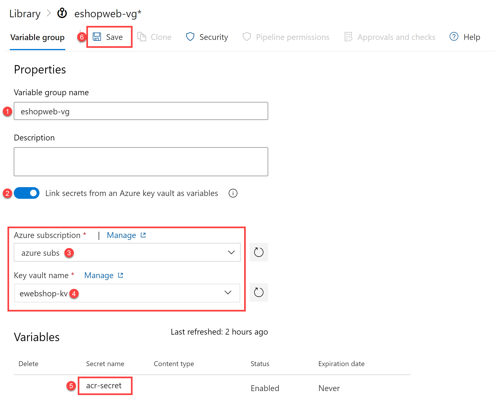

---
lab:
  title: Azure Key Vault を Azure DevOps と統合する
  module: 'Module 04: Implement a secure continuous deployment using Azure Pipelines'
---

# Azure Key Vault を Azure DevOps と統合する

## ラボの要件

- このラボには、**Microsoft Edge** または [Azure DevOps 対応ブラウザー](https://learn.microsoft.com/azure/devops/server/compatibility)が必要です。

- **ラボ環境の検証を完了する。** このラボを開始する前に、[ラボ環境の検証](AZ400_M00_Validate_lab_environment.md)を完了し、このラボに必要な Azure DevOps 組織、プロジェクト、およびサービス接続を設定していることを確認します。

- **Azure DevOps 組織を設定する:** このラボで使用できる Azure DevOps 組織がまだない場合は、[組織またはプロジェクト コレクションの作成](https://learn.microsoft.com/azure/devops/organizations/accounts/create-organization)に関するページの手順に従って作成してください。
- 既存の Azure サブスクリプションを識別するか、新しいものを作成します。

## ラボの概要

Azure Key Vault は、キー、パスワード、証明書などの機密データの安全な保管と管理を行います。 Azure Key Vault には、ハードウェア セキュリティ モジュールのサポートに加えて、さまざまな暗号化アルゴリズムとキーの長さが含まれています。 Azure Key Vault を使用することで、開発者がよく犯す間違いであるソース コードを介して機密データを開示する可能性を最小限に抑えることができます。 Azure Key Vault にアクセスするには、コンテンツに対するきめ細かいアクセス許可をサポートする適切な認証と承認が必要です。

このラボでは、次の手順を使用して、Azure Key Vault を Azure Pipelines と統合する方法について説明します。

- ACR のパスワードをシークレットとして保存する Azure Key Vault を作成します。
- Azure Key Vault 内のシークレットにアクセスできるようにします。
- シークレットを読み取るアクセス許可を構成します。
- Azure Key Vault からパスワードを取得し、それを後続のタスクに渡すようにパイプラインを構成します。

## 目標

このラボを完了すると、次のことができるようになります。

- Azure Key Vault を作成します。
- Azure DevOps パイプラインで Azure Key Vault からシークレットを取得します。
- パイプラインの後続のタスクでシークレットを使用します。
- シークレットを使用して、Azure Container Instance (ACI) にコンテナー イメージをデプロイします。

## 推定時間:40 分

## 手順

### 演習 0: ラボの前提条件を構成する (完了している場合はスキップしてください)

この演習では、ラボの前提条件を設定します。これは、[eShopOnWeb](https://github.com/MicrosoftLearning/eShopOnWeb) に基づくリポジトリを含む新しい Azure DevOps プロジェクトで構成されます。

#### タスク 1: (完了している場合はスキップしてください) チーム プロジェクトを作成して構成する

このタスクでは、複数のラボで使用される **eShopOnWeb** Azure DevOps プロジェクトを作成します。

1. ラボ コンピューターのブラウザー ウィンドウで、Azure DevOps 組織を開きます。 **[新しいプロジェクト]** をクリックします。 プロジェクトに「**eShopOnWeb**」という名前を付け、他のフィールドは既定値のままにします。 **[作成]** をクリックします。

    ![[新しいプロジェクトの作成] パネルのスクリーンショット。](images/create-project.png)

#### タスク 2: (完了している場合はスキップしてください) eShopOnWeb Git リポジトリをインポートする

このタスクでは、複数のラボで使用される eShopOnWeb Git リポジトリをインポートします。

1. ラボ コンピューターのブラウザー ウィンドウで、Azure DevOps 組織と、前に作成した **eShopOnWeb** プロジェクトを開きます。 **[リポジトリ]、[ファイル]**、**[インポート]** の順にクリックします。 **[Git リポジトリをインポートする]** ウィンドウで、URL <https://github.com/MicrosoftLearning/eShopOnWeb.git> を貼り付けて、 **[インポート]** をクリックします。

    

1. リポジトリは次のように編成されています。
    - **.ado** フォルダーには、Azure DevOps の YAML パイプラインが含まれています。
    - **.devcontainer** フォルダーには、コンテナーを使って開発するためのセットアップが含まれています (VS Code でローカルに、または GitHub Codespaces で)。
    - **infra** フォルダーには、一部のラボ シナリオで使用される Bicep および ARM のコードとしてのインフラストラクチャ テンプレートが含まれています。
    - **.github** フォルダーには、YAML GitHub ワークフローの定義が含まれています。
    - **src** フォルダーには、ラボ シナリオで使用される .NET 8 Web サイトが含まれています。

#### タスク 3: (完了している場合はスキップしてください) メイン ブランチを既定のブランチとして設定する

1. **[リポジトリ]、[ブランチ]** の順に移動します。
1. **main** ブランチをポイントし、列の右側に表示される省略記号をクリックします。
1. **[既定のブランチとして設定]** をクリックします。

### 演習 1: CI パイプラインを設定して eShopOnWeb コンテナーをビルドする

この演習では、eShopOnWeb コンテナー イメージをビルドして Azure Container Registry (ACR) にプッシュする CI パイプラインを作成します。 このパイプラインでは Docker Compose を使用してイメージをビルドし、それらを ACR にプッシュします。

#### タスク 1: CI パイプラインをセットアップして実行する

このタスクでは、既存の CI YAML パイプライン定義をインポートし、変更して実行します。 新しい Azure Container Registry (ACR) を作成し、eShopOnWeb コンテナー イメージをビルドして発行します。

1. ラボ コンピューターから Web ブラウザーを起動し、Azure DevOps **eShopOnWeb** プロジェクトに移動します。 **[パイプライン]、[パイプライン]** の順に移動し、**[パイプラインの作成]** (または **[新しいパイプライン]**) をクリックします。

1. **[コードはどこにありますか?]** ウィンドウで、 **[Azure Repos Git (YAML)]** を選択し、**eShopOnWeb** リポジトリを選択します。

1. **[構成]** セクションで、 **[既存の Azure Pipelines YAML ファイル]** を選択します。 **メイン** ブランチを選択し、パス **/.ado/eshoponweb-ci-dockercompose.yml** を指定し、**[続行]** をクリックします。

    

1. YAML パイプライン定義で、**AZ400-EWebShop-NAME** の **NAME** を一意の値に置き換えてリソース グループ名をカスタマイズし、**YOUR-SUBSCRIPTION-ID** をご自身の Azure subscriptionId に置き換えます。

1. **[保存および実行]** をクリックし、パイプラインが正常に実行されるまで待ちます。 パイプラインの作成と実行プロセスを完了するには、**[保存して実行]** をもう一度クリックする必要がある場合があります。

    > **重要**: [This pipeline needs permission to access resources before this run can continue to Docker Compose to ACI] (ACI への Docker Compose に対してこの実行を続けるには、まずこのパイプラインにリソースにアクセスするためのアクセス許可が必要です) というメッセージが表示された場合は、[表示]、[許可]、さらにもう一度 [許可] をクリックします。 この操作は、パイプラインでリソースを作成するために必要です。 アクセス許可メッセージを表示するには、ビルド ジョブをクリックする必要があります。

    > **注**:このビルドは、完了するまで数分かかる場合があります。 ビルドの定義は以下のタスクで構成されます。
    - **AzureResourceManagerTemplateDeployment** は、**bicep** を使用して Azure Container Registry をデプロイします。
    - **PowerShell** タスクは bicep 出力 (acr ログイン サーバー) を受け取り、パイプライン変数を作成します。
    - **DockerCompose** タスクは、eShopOnWeb のコンテナー イメージをビルドし、Azure Container Registry にプッシュします。

1. パイプラインには、プロジェクト名に基づく名前が付けられます。 パイプラインを識別しやすくするために、**名前を変更**しましょう。 **[パイプライン]、[パイプライン]** の順に移動し、先ほど作成したパイプラインをクリックします。 省略記号と **[名前の変更]/[削除]** オプションをクリックします。 **`eshoponweb-ci-dockercompose`** という名前を付けて **[保存]** をクリックします。

1. 実行が完了したら、Azure Portal で、以前に定義したリソース グループを開きます。そうすると、作成されたコンテナー イメージ **eshoppublicapi** と **eshopwebmvc** を含む Azure Container Registry (ACR) が見つかります。 デプロイ フェーズでは **eshopwebmvc** のみを使用します。

    

1. **[アクセス キー]** をクリックし、**[管理ユーザー]** をまだ有効にしていない場合は有効にし、**[パスワード]** の値をコピーします。 これは、次のタスクで Azure Key Vault にシークレットとして保存するために使用します。

    

#### タスク 2: Azure Key Vault を作成する

このタスクでは、Azure portal を使用して Azure Key Vault を作成します。

このラボ シナリオでは、Azure Container Registry (ACR) に格納されているコンテナー イメージをプルして実行する Azure Container Instance (ACI) を使用します。 ACR のパスワードをシークレットとしてキー コンテナーに保存します。

1. Azure portal の **[リソース、サービス、ドキュメントの検索]** テキスト ボックスに「**`Key vault`**」と入力し、**Enter** キーを押します。
1. **[キー コンテナー]** ブレードを選択し、**[作成] > [キー コンテナー]** をクリックします。
1. **[キー コンテナーの作成]** ブレードの **[基本]** タブで、次の設定を指定して **[次へ]** をクリックします。

    | 設定 | 値 |
    | --- | --- |
    | サブスクリプション | このラボで使用している Azure サブスクリプションの名前 |
    | リソース グループ | 新しいリソース グループ **AZ400-EWebShop-NAME** の名前 |
    | キー コンテナー名 | **ewebshop-kv-NAME** などの一意の有効な名前 (NAME を置き換えてください) |
    | リージョン | ラボ環境の場所に近い Azure リージョン |
    | Pricing tier | **Standard** |
    | 削除されたボールトを保持する日数 | **7** |
    | 消去保護 | **消去保護を無効にする** |

1. **[キー コンテナーの作成]** ブレードの **[アクセスの構成]** タブで、 **[コンテナー アクセス ポリシー]** を選択し、 **[アクセス ポリシー]** セクションで、 **[+ 作成]** をクリックして新しいポリシーを設定します。

    > **注**:許可されたアプリケーションとユーザーのみを許可することにより、Key Vault のアクセスを保護する必要があります。 コンテナーからデータにアクセスするには、パイプラインでの認証のためにラボ環境の検証中に作成したサービス接続に対する読み取り (Get/List) アクセス許可を提供する必要があります。

    1. **[アクセス許可]** ブレードで、 **[シークレットのアクセス許可]** の下にある **[取得]** と **[一覧表示]** のアクセス許可をオンにします。 **[次へ]** をクリックします。
    2. **[プリンシパル]** ブレードで、**Azure サブスクリプション サービス接続** (ラボ環境の検証中に作成されたもの。通常は "azure subs" という名前) を検索し、一覧から選択します。 サービス プリンシパル名は、Azure DevOps の [プロジェクト設定] > [サービス接続] > [azure subs] > [サービス プリンシパルの管理] にあります。 Azure サブスクリプションを選択するときにアクセス許可エラーが発生した場合は、**[承認]** ボタンをクリックすると、キー コンテナーに自動的にアクセス ポリシーが作成されます。 **[次へ]** 、 **[次へ]** 、 **[作成]** (アクセス ポリシー) の順にクリックします。
    3. **[確認と作成]** ブレードで、 **[作成]** をクリックします

1. **[キー コンテナーの作成]** ブレードに戻り、 **[確認と作成] > [作成]** をクリックします

    > **注**: Azure Key Vault がプロビジョニングされるのを待ちます。 これにかかる時間は 1 分未満です。

1. **[デプロイが完了しました]** ブレードで、 **[リソースに移動]** をクリックします。
1. Azure Key Vault (ewebshop-kv-NAME) ブレードで、ブレードの左側にある垂直メニューの **[オブジェクト]** セクションで **[シークレット]** をクリックします。
1. **[シークレット]** ブレードで、 **[生成/インポート]** をクリックします。
1. **[シークレットの作成]** ブレードで、次の設定を指定し、 **[作成]** をクリックします (他の設定は既定値のままにします)。

    | 設定 | 値 |
    | --- | --- |
    | Upload options | **手動** |
    | 名前 | **acr-secret** |
    | シークレット値 | 前のタスクでコピーした ACR アクセス パスワード |

#### タスク 3: Azure Key Vault に接続された変数グループを作成する

このタスクでは、先ほど作成したサービス接続を使用して Azure Key Vault から ACR パスワード シークレットを取得する変数グループを Azure DevOps に作成します。

1. ラボ コンピューターで Web ブラウザーを起動し、Azure DevOps プロジェクト **eShopOnWeb** に移動します。

1. Azure DevOps ポータルの縦型ナビゲーション ウィンドウで、**[パイプライン] > [ライブラリ]** を選択します。 **[+ 変数グループ]** をクリックします。

1. **[新しい変数グループ]** ブレードで、次の設定を指定します。

    | 設定 | 値 |
    | --- | --- |
    | 変数グループ名 | **eshopweb-vg** |
    | Azure Key Vault のシークレットにリンクする | **enable** |
    | Azure サブスクリプション | **[利用可能な Azure サービス接続] > [Azure subs]** |
    | キー コンテナー名 | キー コンテナー名|

1. **[変数]** の下の **[+ 追加]** をクリックし、**acr-secret** シークレットを選択します。 **[OK]** をクリックします。
1. **[Save]** をクリックします。

    

#### タスク 4: CD パイプラインをセットアップして Azure Container Instance (ACI) にコンテナーをデプロイする

このタスクでは、CD パイプラインをインポートしてカスタマイズし、前に作成したコンテナー イメージを Azure Container Instance にデプロイするために実行します。

1. ラボ コンピューターから Web ブラウザーを起動し、Azure DevOps **eShopOnWeb** プロジェクトに移動します。 **[パイプライン]、[パイプライン]** の順に移動し、**[新しいパイプライン]** をクリックします。

1. **[コードはどこにありますか?]** ウィンドウで、 **[Azure Repos Git (YAML)]** を選択し、**eShopOnWeb** リポジトリを選択します。

1. **[構成]** セクションで、 **[既存の Azure Pipelines YAML ファイル]** を選択します。 **メイン** ブランチを選択し、パス **/.ado/eshoponweb-cd-aci.yml** を指定し、**[続行]** をクリックします。

1. YAML パイプライン定義で、次をカスタマイズします。

    - **YOUR-SUBSCRIPTION-ID** を使用する Azure サブスクリプション ID にします。
    - **az400eshop-NAME** の NAME を置き換えて、グローバルに一意にします。
    - **YOUR-ACR.azurecr.io** と **ACR-USERNAME** を使用する ACR ログイン サーバーにします (どちらも ACR 名が必要です。[ACR]、[アクセス キー] の順に選択して確認できます)。
    - **AZ400-EWebShop-NAME** をラボで前に定義したリソース グループ名にします。

1. **[保存および実行]** をクリックします。 パイプラインの作成と実行プロセスを完了するには、**[保存して実行]** をもう一度クリックする必要がある場合があります。 すべてのアクセス許可メッセージを表示するには、ビルド ジョブをクリックする必要があります。
1. パイプラインを開き、正常に実行されるまで待ちます。

    > **重要**: [This pipeline needs permission to access resources before this run can continue to Docker Compose to ACI] (ACI への Docker Compose に対してこの実行を続けるには、まずこのパイプラインにリソースにアクセスするためのアクセス許可が必要です) というメッセージが表示された場合は、[表示]、[許可]、さらにもう一度 [許可] をクリックします。 この操作は、パイプラインでリソースを作成するために必要です。

    > **注**: デプロイが完了するまでに数分かかる場合があります。 CD の定義は以下のタスクで構成されます。
    - **リソース** : CI パイプラインの完了に基づいて自動的にトリガーされるように準備されています。 また、bicep ファイルのリポジトリもダウンロードします。
    - **変数 (デプロイ ステージ用)** は変数グループに接続して、Azure Key Vault シークレット **acr-secret** を使用します
    - **AzureResourceManagerTemplateDeployment** は、bicep テンプレートを使用して Azure Container Instance (ACI) をデプロイし、ACR ログイン パラメーターを指定して、ACI が以前に作成したコンテナー イメージを Azure Container Registry (ACR) からダウンロードできるようにします。

1. パイプライン デプロイの結果を確認するには、Azure portal で、**AZ400-EWebShop-NAME** リソース グループを検索して選択します。 リソースの一覧で、**az400eshop** コンテナー インスタンスがパイプラインによって作成されたことを確認します。

1. パイプラインには、プロジェクト名に基づく名前が付けられます。 パイプラインを識別しやすくするために、**名前を変更**しましょう。 **[パイプライン]、[パイプライン]** の順に移動し、先ほど作成したパイプラインをクリックします。 省略記号と **[名前の変更]/[削除]** オプションをクリックします。 **eshoponweb-cd-aci** という名前を付け、 **[保存]** をクリックします。

   > [!IMPORTANT]
   > 不要な料金が発生しないように、Azure portal で作成されたリソースを必ず削除してください。

## 確認

このラボでは、次の手順を使用して、Azure KeyVault を Azure DevOps パイプラインと統合しました。

- ACR のパスワードをシークレットとして保存する Azure Key Vault を作成しました。
- Azure Key Vault 内のシークレットにアクセスできるようにしました。
- シークレットを読み取るアクセス許可を構成しました。
- Azure Key Vault からパスワードを取得して後続のタスクに渡すようにパイプラインを構成しました。
- シークレットを使用して、Azure Container Instance (ACI) にコンテナー イメージをデプロイしました。
- Azure Key Vault に接続された変数グループを作成しました。
