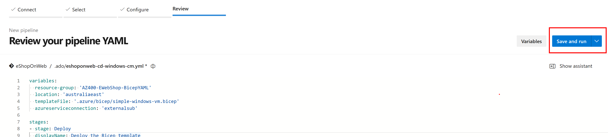

---
lab:
  title: Azure Bicep テンプレートを使用したデプロイ
  module: 'Module 06: Manage infrastructure as code using Azure and DSC'
---

# Azure Bicep テンプレートを使用したデプロイ

## 受講生用ラボ マニュアル

## ラボの要件

- このラボには、**Microsoft Edge** または [Azure DevOps 対応ブラウザー](https://docs.microsoft.com/azure/devops/server/compatibility)が必要です。

- **Azure DevOps 組織を設定する:** このラボで使用できる Azure DevOps 組織がまだない場合は、[組織またはプロジェクト コレクションの作成](https://docs.microsoft.com/azure/devops/organizations/accounts/create-organization)に関するページの手順に従って作成してください。

- 既存の Azure サブスクリプションを識別するか、新しいものを作成します。

- Azure サブスクリプションの所有者ロールと、Azure サブスクリプションに関連付けられた Microsoft Entra テナントの全体管理者ロールを持つ Microsoft アカウントまたは Microsoft Entra アカウントがあることを確認します。 詳細については、[「Azure portal を使用して Azure ロールの割り当てを一覧表示する」](https://docs.microsoft.com/azure/role-based-access-control/role-assignments-list-portal)および[「Azure Active Directory で管理者ロールを表示して割当てる」](https://docs.microsoft.com/azure/active-directory/roles/manage-roles-portal)を参照してください。

## ラボの概要

このラボでは、Azure Bicep テンプレートを作成し、Azure Bicep モジュールの概念を使ってそれをモジュール化します。 次に、モジュールを使用するようにメイン デプロイ テンプレートを変更して、最後にすべてのリソースを Azure にデプロイします。

## 目標

このラボを完了すると、次のことができるようになります。

- Azure Bicep テンプレートの構造を理解します。
- 再利用可能な Bicep モジュールを作成します。
- モジュールを使うようにメイン テンプレートを変更する
- Azure YAML パイプラインを使って、すべてのリソースを Azure にデプロイします。

## 推定時間:45 分

## Instructions

### 演習 0:ラボの前提条件の構成

この演習では、ラボの前提条件を設定します。これは、[eShopOnWeb](https://github.com/MicrosoftLearning/eShopOnWeb) に基づくリポジトリを含む新しい Azure DevOps プロジェクトで構成されます。

#### タスク 1: (完了している場合はスキップしてください) チーム プロジェクトを作成して構成する

このタスクでは、複数のラボで使用される **eShopOnWeb** Azure DevOps プロジェクトを作成します。

1. ラボ コンピューターのブラウザー ウィンドウで、Azure DevOps 組織を開きます。 **[新しいプロジェクト]** をクリックします。 プロジェクトに「**eShopOnWeb**」という名前を付け、他のフィールドは既定値のままにします。 **[作成]** をクリックします。

    

#### タスク 2: (完了している場合はスキップしてください) eShopOnWeb Git リポジトリをインポートする

このタスクでは、複数のラボで使用される eShopOnWeb Git リポジトリをインポートします。

1. ラボ コンピューターのブラウザー ウィンドウで、Azure DevOps 組織と、前に作成した **eShopOnWeb** プロジェクトを開きます。 **[リポジトリ] > [ファイル]** 、 **[リポジトリをインポートする]** をクリックします。 **[インポート]** を選択します。 **[Git リポジトリをインポートする]** ウィンドウで、URL https://github.com/MicrosoftLearning/eShopOnWeb.git を貼り付けて、 **[インポート]** をクリックします。

    

1. リポジトリは次のように編成されています。
    - **.ado** フォルダーには、Azure DevOps の YAML パイプラインが含まれています。
    - **.devcontainer** フォルダーには、コンテナーを使って開発するためのセットアップが含まれています (VS Code でローカルに、または GitHub Codespaces で)。
    - **.azure** フォルダーには、一部のラボ シナリオで使用される Bicep&ARM コードとしてのインフラストラクチャ テンプレートが含まれています。
    - **.github** フォルダーには、YAML GitHub ワークフローの定義が含まれています。
    - **src** フォルダーには、ラボ シナリオで使用される .NET 6 Web サイトが含まれています。

### 演習 1: Azure Bicep テンプレートを理解し、再利用可能なモジュールを使って簡略化する

このラボでは、Azure Bicep テンプレートを確認し、再利用可能なモジュールを使って簡略化します。

#### タスク 1: Azure Bicep テンプレートを作成する

このタスクでは、Visual Studio Code を使って Azure Bicep テンプレートを作成します

1. Azure DevOps プロジェクトを開いているブラウザーのタブで、 **[リポジトリ]** と **[ファイル]** に移動します。 `.azure\bicep` フォルダーを開き、`simple-windows-vm.bicep` ファイルを見つけます。

   

1. テンプレートをレビューし、その構造をよりよく把握します。 型、既定値、検証を含むいくつかのパラメーター、いくつかの変数、以下の型を持つかなりの数のリソースがあります。

   - Microsoft.Storage/storageAccounts
   - Microsoft.Network/publicIPAddresses
   - Microsoft.Network/virtualNetworks
   - Microsoft.Network/networkInterfaces
   - Microsoft.Compute/virtualMachines

1. リソース定義のシンプルさと、テンプレート全体を通して明示的な `dependsOn` ではなく暗黙的にシンボリック名を参照できることに注意してください。

#### タスク 2: ストレージ リソースの Bicep モジュールを作成する

このタスクでは、ストレージ テンプレート モジュール **storage.bicep** を作成します。これにより、ストレージ アカウントのみが作成され、メイン テンプレートによってインポートされます。 ストレージ テンプレート モジュールは、メイン テンプレート **main.bicep** に値を戻す必要があります。この値は、ストレージ テンプレート モジュールの出力要素で定義されます。

1. まず、メイン テンプレートからストレージ リソースを削除する必要があります。 ブラウザー ウィンドウの右上隅から **[編集]** ボタンをクリックします。

   

1. 次にストレージ リソースを削除します。

   ```bicep
   resource storageAccount 'Microsoft.Storage/storageAccounts@2022-05-01' = {
     name: storageAccountName
     location: location
     sku: {
       name: 'Standard_LRS'
     }
     kind: 'Storage'
   }
   ```

1. ファイルをコミットしますが、まだこれで終わりではありません。

   

1. 次に、bicep フォルダーにマウス カーソルを合わせて省略記号アイコンをクリックし、 **[新規作成]** 、 **[ファイル]** の順に選びます。 名前に「**storage.bicep**」と入力し、 **[作成]** をクリックします。

   ![新規作成の [ファイル] メニュー](./images/m06/newfile.png)

1. 次に、次のコード スニペットを ファイルにコピーし、変更をコミットします。

   ```bicep
   @description('Location for all resources.')
   param location string = resourceGroup().location

   @description('Name for the storage account.')
   param storageAccountName string

   resource storageAccount 'Microsoft.Storage/storageAccounts@2022-05-01' = {
     name: storageAccountName
     location: location
     sku: {
       name: 'Standard_LRS'
     }
     kind: 'Storage'
   }

   output storageURI string = storageAccount.properties.primaryEndpoints.blob
   ```

#### タスク 3: テンプレート モジュールを使うようにメイン テンプレートを変更する

このタスクでは、前のタスクで作成したテンプレート モジュールを参照するように、メイン テンプレートを変更します。

1. `simple-windows-vm.bicep` ファイルに戻り、 **[編集]** ボタンをもう一度クリックします。

1. 次に、変数の後に次のコードを追加します。

   ```bicep
   module storageModule './storage.bicep' = {
     name: 'linkedTemplate'
     params: {
       location: location
       storageAccountName: storageAccountName
     }
   }
   ```

1. また、代わりにモジュールの出力を使うように、仮想マシン リソースのストレージ アカウント BLOB URI への参照を変更する必要があります。 仮想マシン リソースを見つけて、diagnosticsProfile セクションを次のように置き換えます。

   ```bicep
   diagnosticsProfile: {
     bootDiagnostics: {
       enabled: true
       storageUri: storageModule.outputs.storageURI
     }
   }
   ```

1. メイン テンプレートで以下の詳細をレビューします:

   - メイン テンプレートのモジュールは、別のテンプレートにリンクするために使われます。
   - モジュールのシンボル名は `storageModule` です。 依存関係を構成する場合はこの名前を使います。
   - テンプレート モジュールを使うときは、**増分**デプロイ モードのみを使用できます。
   - テンプレート モジュールには相対パスを使います。
   - パラメーターを使って、メイン テンプレートからテンプレート モジュールに値を渡します。

1. テンプレートをコミットします。

### 演習 2: YAML パイプラインを使って Azure にテンプレートをデプロイする

このラボでは、サービス接続を作成し、それを Azure DevOps YAML パイプラインで使って、テンプレートを Azure 環境にデプロイします。

#### タスク 1: (完了している場合はスキップする) デプロイ用のサービス接続を作成する

このタスクでは、Azure CLI を使ってサービス プリンシパルを作成します。これにより、Azure DevOps で次のことができるようになります。

- Azure サブスクリプションでリソースをデプロイします。
- 後で作成する Key Vault シークレットに対する読み取りアクセス権を取得する。

> **注**: サービス プリンシパルが既にある場合は、次のタスクに直接進むことができます。

Azure Pipelines から Azure リソースをデプロイするには、サービス プリンシパルが必要です。 パイプラインでシークレットを取得するため、Azure キー コンテナーを作成するときにサービスにアクセス許可を付与する必要があります。

サービス プリンシパルは、パイプライン定義内から Azure サブスクリプションに接続するとき、またはプロジェクト設定ページから新しいサービス接続を作成するときに (自動オプション)、Azure Pipelines によって自動的に作成されます。 ポータルから、または Azure CLI を使用してサービス プリンシパルを手動で作成し、プロジェクト間で再利用することもできます。

1. ラボのコンピューターで Web ブラウザーを起動し、[**Azure portal**](https://portal.azure.com) に移動します。このラボで使用する Azure サブスクリプションで、所有者のロールがあり、このサブスクリプションに関連付けられている Microsoft Entra テナントで全体管理者のロールがあるユーザー アカウントを使ってサインインします。
1. Azure portal で、ページ上部の検索テキストボックスのすぐ右側にある **Cloud Shell** アイコンをクリックします。
1. **Bash** または **PowerShell** の選択を求めるメッセージが表示されたら、**[Bash]** を選択します。

   >**注**: **Cloud Shell** を初めて起動し、[**ストレージがマウントされていません**] というメッセージが表示された場合は、このラボで使用しているサブスクリプションを選択し、**[ストレージの作成]** を選択します。

1. **Bash** プロンプトの **[Cloud Shell]** ペインで、次のコマンドを実行して、Azure サブスクリプション ID とサブスクリプション名の属性の値を取得します。

    ```bash
    az account show --query id --output tsv
    az account show --query name --output tsv
    ```

    > **注**:両方の値をテキスト ファイルにコピーします。 これらは、このラボの後半で必要になります。

1. **Bash** プロンプトの **Cloud Shell** ペインで、次のコマンドを実行してサービス プリンシパルを作成します (**myServicePrincipalName** を文字と数字で構成される一意の文字列に、**mySubscriptionID** をご自分の Azure subscriptionId に置き換えてください)。

    ```bash
    az ad sp create-for-rbac --name myServicePrincipalName \
                         --role contributor \
                         --scopes /subscriptions/mySubscriptionID
    ```

    > **注**:このコマンドは JSON 出力を生成します。 出力をテキスト ファイルにコピーします。 このラボで後ほど必要になります。

1. 次に、ラボ コンピューターから Web ブラウザーを起動し、Azure DevOps **eShopOnWeb** プロジェクトに移動します。 **[プロジェクトの設定] > [サービス接続] ([パイプライン] の下)** 、 **[新しいサービス接続]** の順にクリックします。

    

1. **[新しいサービス接続]** ブレードで、 **[Azure Resource Manager]** と **[次へ]** を選択します (下にスクロールする必要がある場合があります)。

1. **[サービス プリンシパル (手動)]** を選択し、 **[次へ]** をクリックします。

1. 前の手順で収集した情報を使って、空のフィールドに入力します。
    - サブスクリプション ID と名前。
    - サービス プリンシパル ID (appId)、サービス プリンシパル キー (パスワード)、テナント ID (テナント)。
    - **[サービス接続名]** に「**azure subs**」と入力します。 この名前は、Azure サブスクリプションと通信するために Azure DevOps サービス接続が必要になるときに、YAML パイプラインで参照されます。

    

1. **[確認して保存]** をクリックします。

#### タスク 2: YAML パイプラインによって Azure にリソースをデプロイする
1. **[パイプライン]** ハブで **[パイプライン]** に戻ります。
1. **[最初のパイプラインを作成]** ウィンドウで、**[パイプラインの作成]** をクリックします。

    > **注**: ウィザードを使い、プロジェクトに基づいて新しい YAML パイプラインの定義を作成します。

1. **[コードはどこにありますか?]** ペインで **[Azure Repos Git (YAML)]** オプションをクリックします。
1. **[リポジトリの選択]** ペインで **EShopOnWeb** をクリックします。
1. **[パイプラインを構成する]** ペインで、 **[既存の Azure Pipelines YAML ファイル]** を選びます。
1. **[既存の YAML ファイルを選択する]** ペインで、次のパラメーターを指定します。
   - [ブランチ]: **main**
   - パス: **.ado/eshoponweb-cd-windows-cm.yml**
1. **[続行]** をクリックして、これらの設定を保存します。
1. 変数セクションで、リソース グループの名前を選び、目的の場所を設定し、サービス接続の値を先ほど作成した既存のサービス接続のいずれかに置き換えます。
1. 右上隅のコーダーから **[保存して実行]** ボタンをクリックし、コミット ダイアログが表示されたら、もう一度 **[保存して実行]** をクリックします。

   

1. デプロイが完了するまで待ってから、結果を確認します。
   

#### タスク 3: Azure ラボ リソースを削除する

このタスクでは、Azure Cloud Shell を使用して、このラボでプロビジョニングされた Azure リソースを削除し、不要な料金を排除します。

1. Azure portal で、**Cloud Shell** ウィンドウ内で **Bash** シェル セッションを開きます。
1. 次のコマンドを実行して、このモジュールのラボを通して作成したすべてのリソース グループを削除します (リソース グループ名は選んだものに置き換えてください)。

   ```bash
   az group list --query "[?starts_with(name,'AZ400-EWebShop-NAME')].[name]" --output tsv | xargs -L1 bash -c 'az group delete --name $0 --no-wait --yes'
   ```

   > **注**:コマンドは非同期に実行されるので (--nowait パラメーターで決定される)、同じ Bash セッション内ですぐに別の Azure CLI コマンドを実行できますが、リソース グループが実際に削除されるまでに数分かかります。

## 確認

このラボでは、Azure Bicep テンプレートを作成し、テンプレート モジュールを使ってこれをモジュラー化し、メイン デプロイ テンプレートを変更してモジュールと更新済みの依存関係を呼び出し、最後に YAML パイプラインを使ってテンプレートを Azure にデプロイする方法を学びました。
