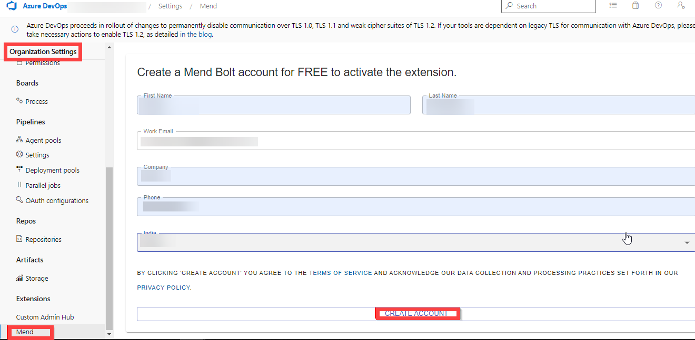

---
lab:
  title: Azure DevOps パイプラインにセキュリティとコンプライアンスを実装する
  module: 'Module 07: Implement security and validate code bases for compliance'
---

# Azure DevOps パイプラインにセキュリティとコンプライアンスを実装する

## 受講生用ラボ マニュアル

## ラボの要件

- このラボには、**Microsoft Edge** または [Azure DevOps 対応ブラウザー](https://learn.microsoft.com/azure/devops/server/compatibility)が必要です。

- **Azure DevOps 組織を設定する:** このラボで使用できる Azure DevOps 組織がまだない場合は、[組織またはプロジェクト コレクションの作成](https://learn.microsoft.com/azure/devops/organizations/accounts/create-organization)に関するページの手順に従って作成してください。

## ラボの概要

このラボでは、**Mend Bolt (旧称 WhiteSource)** を使って、脆弱なオープン ソース コンポーネント、古いライブラリ、コードのライセンス コンプライアンスの問題を自動的に検出します。 WebGoat を使用しますが、これは一般的な Web アプリケーションのセキュリティの問題を説明するために設計された OWASP によって維持される、意図的に安全でない Web アプリケーションです。

[Mend](https://www.mend.io/) は、継続的オープン ソース ソフトウェア セキュリティおよびコンプライアンス管理のリーダーです。 WhiteSource は、プログラミング言語、ビルド ツール、または開発環境に関係なく、ビルド プロセスに統合します。 自動的かつ継続的にバックグラウンドでサイレントに機能し、WhiteSource の常に更新されているオープン ソース リポジトリの最終データベースに対してオープン ソース コンポーネントのセキュリティ、ライセンス、品質を確認します。

Mend の提供する Mend Bolt は、特に Azure DevOps および Azure DevOps Server との統合向けに開発されたライトウェイト オープン ソース セキュリティおよび管理ソリューションです。 Mend Bolt はプロジェクトに基づいて機能し、リアルタイムのアラート機能が備えられていないため、**フル プラットフォーム**が必要です。これは通常、ソフトウェア開発サイクル全体 (リポジトリからデプロイ後ステージ) を通して、あらゆるプロジェクトと製品でオープン ソース管理の自動化を希望する、より大きな開発チームで推奨されるものです。

Azure DevOps を Mend Bolt に統合すると以下が可能になります:

- 脆弱なオープンソースコンポーネントを検出して修正します。
- プロジェクトまたはビルドごとに包括的なオープン ソース インベントリ レポートを生成します。
- 依存関係のライセンスを含む、オープン ソース ライセンスのコンプライアンスを実施します。
- 更新の推奨事項がある古いオープン ソース ライブラリを特定します。

## 目標

このラボを完了すると、次のことができるようになります。

- Mend Bolt をアクティブにする。
- ビルド パイプラインを実行し、Mend のセキュリティとコンプライアンス レポートを確認します。

## 推定時間:45 分

## Instructions

### 演習 0:ラボの前提条件の構成

この演習では、ラボの前提条件を設定します。これは、[eShopOnWeb](https://github.com/MicrosoftLearning/eShopOnWeb) に基づくリポジトリを含む新しい Azure DevOps プロジェクトで構成されます。

#### タスク 1: (完了している場合はスキップしてください) チーム プロジェクトを作成して構成する

このタスクでは、複数のラボで使用される **eShopOnWeb** Azure DevOps プロジェクトを作成します。

1. ラボ コンピューターのブラウザー ウィンドウで、Azure DevOps 組織を開きます。 **[新しいプロジェクト]** をクリックします。 プロジェクトに「**eShopOnWeb**」という名前を付け、他のフィールドは既定値のままにします。 **[作成]** をクリックします。

    

#### タスク 2: (完了している場合はスキップしてください) eShopOnWeb Git リポジトリをインポートする

このタスクでは、複数のラボで使用される eShopOnWeb Git リポジトリをインポートします。

1. ラボ コンピューターのブラウザー ウィンドウで、Azure DevOps 組織と、前に作成した **eShopOnWeb** プロジェクトを開きます。 **[リポジトリ] > [ファイル]** 、 **[インポート]** をクリックします。 **[Git リポジトリをインポートする]** ウィンドウで、URL https://github.com/MicrosoftLearning/eShopOnWeb.git を貼り付けて、 **[インポート]** をクリックします。

    

2. リポジトリは次のように編成されています。
    - **.ado** フォルダーには、Azure DevOps の YAML パイプラインが含まれています。
    - **.devcontainer** フォルダーには、コンテナーを使って開発するためのセットアップが含まれています (VS Code でローカルに、または GitHub Codespaces で)。
    - **.azure** フォルダーには、一部のラボ シナリオで使用される Bicep&ARM コードとしてのインフラストラクチャ テンプレートが含まれています。
    - **.github** フォルダーには、YAML GitHub ワークフローの定義が含まれています。
    - **src** フォルダーには、ラボ シナリオで使用される .NET 7 Web サイトが含まれています。

### 演習 1: Mend Bolt を使用して Azure DevOps パイプラインにセキュリティとコンプライアンスを実装する

この演習では、Mend Bolt を利用し、セキュリティの脆弱性とライセンスのコンプライアンスの問題に関してプロジェクト コードをスキャンし、その結果作成されるレポートを表示します。

#### タスク 1: Mend Bolt 拡張機能をアクティブにする

このタスクでは、新しい生成された Azure Devops プロジェクトで WhiteSource Bolt をアクティブにします。

1. ラボ コンピューターの、**eShopOnWeb** プロジェクトが開かれて Azure DevOps ポータルが表示されている Web ブラウザー ウィンドウで、マーケットプレース アイコン > **[Marketplace の参照]** をクリックします。

    

2. MarketPlace で、**Mend Bolt (旧称 WhiteSource)** を探して開きます。 Mend Bolt は、以前は WhiteSource と呼ばれていたツールの無料バージョンであり、すべてのプロジェクトをスキャンして、オープンソース コンポーネント、ライセンス、既知の脆弱性を検出します。

    > 警告: Mend **Bolt** オプション (**無料**のもの) を必ず選んでください。

3. **[Mend Bolt (formerly WhiteSource)] (Mend Bolt (旧称 WhiteSource))** ページで、 **[無料で入手できます]** をクリックします。

    

4. 次のページで、目的の Azure DevOps 組織を選んで **[インストール]** を選びます。 インストールが完了したら **[組織に進む]** を選びます。

5. Azure DevOps で **[組織の設定]** に移動し、 **[拡張機能]** の下にある **[Mend]** を選びます。 仕事用メール アドレス (**自分のラボ用個人アカウント**、たとえば student@microsoft.com ではなく AZ400learner@outlook.com を使います)、会社名、その他の詳細を指定し、 **[アカウントの作成]** ボタンをクリックして無料版の使用を始めます。

    

#### タスク 2: ビルドを作成してトリガーする

このタスクでは、Azure DevOps プロジェクト内で CI ビルド パイプラインを作成してトリガーします。 **Mend Bolt** 拡張機能を使って、このコード内に存在する脆弱な OSS コンポーネントを特定します。

1. ラボ コンピューターの **eShopOnWeb** Azure DevOps プロジェクトの左側にある垂直メニュー バーで、 **[パイプライン] > [パイプライン]** セクションに移動し、 **[パイプラインの作成]** (または **[新しいパイプライン]** ) をクリックします。

2. **[コードはどこにありますか?]** ウィンドウで、 **[Azure Repos Git (YAML)]** を選択し、**eShopOnWeb** リポジトリを選択します。

3. **[構成]** セクションで、 **[既存の Azure Pipelines YAML ファイル]** を選択します。 パス **/.ado/eshoponweb-ci-mend.yml** を指定して、 **[続行]** をクリックします。

    

4. パイプラインを確認して、 **[実行]** をクリックします。 正常に実行されるまで数分かかります。
    > **注**:このビルドは、完了するまで数分かかる場合があります。 ビルドの定義は以下のタスクで構成されます。
    - dotnet プロジェクトの復元、ビルド、テスト、発行のための **DotnetCLI** タスク。
    - OSS ライブラリの Mend ツール分析を実行するための **Whitesource** タスク (まだ古い名前のままです)。
    - **成果物の発行** このパイプラインを実行しているエージェントは、発行された Web プロジェクトをアップロードします。

5. パイプラインの実行中に、**名前を変更**して識別しやすくしましょう (プロジェクトを複数のラボで使う可能性があるため)。 Azure DevOps プロジェクトの **[パイプライン] > [パイプライン]** セクションに移動し、実行中のパイプライン名 (既定の名前が表示されます) をクリックして、省略記号アイコンで **[名前の変更/移動]** オプションを見つけます。 名前を **eshoponweb-ci-mend** に変更して、 **[保存]** をクリックします。

    

6. パイプラインの実行が完了したら、結果を確認できます。 **eshoponweb-ci-mend** パイプラインの最新の実行を開きます。 概要タブに、実行のログと共に、使われているリポジトリのバージョン (コミット)、トリガーの種類、発行された成果物、テスト カバレッジなどの関連する詳細が表示されます。

7. **[Mend Bolt]** タブでは、OSS のセキュリティ分析を確認できます。 そこでは、使われているインベントリの詳細、見つかった脆弱性 (およびそれらを解決する方法)、ライブラリ関連のライセンスに関する重要なレポートが示されます。 すこし時間を取ってレポートを確認します。

    

## 確認

このラボでは、**Mend Bolt と Azure DevOps** を使って、脆弱なオープン ソース コンポーネント、古いライブラリ、コードのライセンス コンプライアンスの問題を自動的に検出します。
