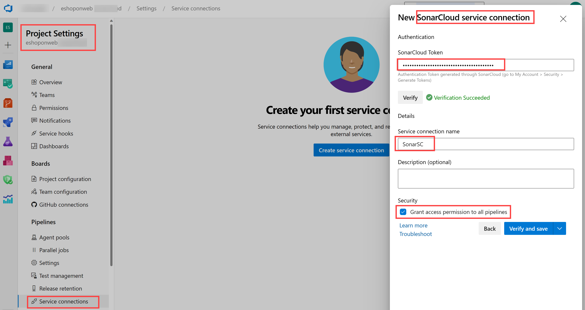
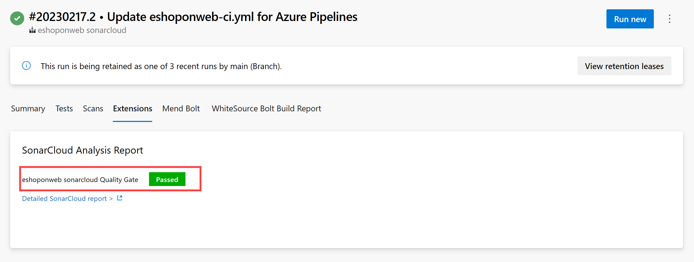

---
lab:
  title: SonarCloud および Azure DevOps による技術的負債の管理
  module: 'Module 07: Implement security and validate code bases for compliance'
---

# SonarCloud および Azure DevOps による技術的負債の管理

## 受講生用ラボ マニュアル

## ラボの要件

- このラボには、**Microsoft Edge** または [Azure DevOps 対応ブラウザー](https://docs.microsoft.com/azure/devops/server/compatibility)が必要です。

- **Azure DevOps 組織を設定する:** このラボで使用できる Azure DevOps 組織がまだない場合は、[組織またはプロジェクト コレクションの作成](https://docs.microsoft.com/azure/devops/organizations/accounts/create-organization)に関するページの手順に従って作成してください。

## ラボの概要

Azure DevOps の文脈では、**技術的負債**という用語は、戦術的な目標を達成するための最適ではない手段を表し、ソフトウェア開発とデプロイにおける戦略目標を達成する能力に悪影響を及ぼすものです。 技術的負債は、コードを理解しにくくなる、失敗しやすくなる、変更に時間がかかる、検証が難しいといった点で生産性に影響します。 適切な監視と管理を行わなければ、技術的負債は時間とともに蓄積し、長期的にはソフトウェアの全体的な品質と開発チームの生産性に重大なインパクトを与えます。

[SonarCloud](https://sonarcloud.io/){:target="\_blank"} は、クラウドベースのコード品質およびセキュリティ サービスです。 SonarCloud のおもな特徴は以下の通りです:

- 23 のプログラミング言語とスクリプト言語をサポートしています (Java、JS、C#、C/C++、Objective-C、TypeScript、Python、ABAP、PLSQL、T-SQL など)。
- 強力な静的コード アナライザーに基づいて、見つけにくいバグや品質の問題を追跡するための規則が何千個も用意されています。
- 人気の高い CI サービスを使用したクラウド ベースのインテグレーション （Travis、Azure DevOps、BitBucket、AppVeyor など）。
- ブランチとプル要求のあらゆるソース ファイルを調べる詳細なコード分析で、緑のクオリティ ゲートを達成してビルドを促進。
- スピードとスケーラビリティ。

このラボでは、Azure DevOps と SonarCloud を統合する方法について学習します。

> **注**:このラボを実行する前に、Azure Pipelines を実行できることを確認してください。 2021 年 2 月に行われたパブリック プロジェクトの変更により、パイプラインへのアクセスを要求する必要があります: <https://devblogs.microsoft.com/devops/change-in-azure-pipelines-grant-for-public-projects/>

## 目標

このラボを完了すると、次のことができるようになります。

- Azure DevOps プロジェクトと CI ビルドを設定して SonarCloud と統合する。
- SonarCloud レポートを分析する。
- 静的分析を Azure DevOps pull request プロセスに統合する。

## 推定時間:60 分

## Instructions

### 演習 0:ラボの前提条件の構成

この演習では、ラボの前提条件を設定します。これは、[eShopOnWeb](https://github.com/MicrosoftLearning/eShopOnWeb) に基づくリポジトリを含む新しい Azure DevOps プロジェクトで構成されます。

#### タスク 1: (完了している場合はスキップしてください) チーム プロジェクトを作成して構成する

このタスクでは、複数のラボで使用される **eShopOnWeb** Azure DevOps プロジェクトを作成します。

1. ラボ コンピューターのブラウザー ウィンドウで、Azure DevOps 組織を開きます。 **[新しいプロジェクト]** をクリックします。 プロジェクトに **eShopOnWeb** という名前を付け、 **[作業項目プロセス]** ドロップダウンで **[スクラム]** を選びます。 **[作成]** をクリックします。

    

#### タスク 2: (完了している場合はスキップしてください) eShopOnWeb Git リポジトリをインポートする

このタスクでは、複数のラボで使用される eShopOnWeb Git リポジトリをインポートします。

1. ラボ コンピューターのブラウザー ウィンドウで、Azure DevOps 組織と、前に作成した **eShopOnWeb** プロジェクトを開きます。 **[リポジトリ] > [ファイル]** 、 **[インポート]** をクリックします。 **[Git リポジトリをインポートする]** ウィンドウで、URL <https://github.com/MicrosoftLearning/eShopOnWeb.git> を貼り付けて、 **[インポート]** をクリックします。

    

1. リポジトリは次のように編成されています。
    - **.ado** フォルダーには、Azure DevOps の YAML パイプラインが含まれています。
    - **.devcontainer** フォルダーには、コンテナーを使って開発するためのセットアップが含まれています (VS Code でローカルに、または GitHub Codespaces で)。
    - **infra** フォルダーには、一部のラボ シナリオで使用される Bicep および ARM のコードとしてのインフラストラクチャ テンプレートが含まれています。
    - **.github** フォルダーには、YAML GitHub ワークフローの定義が含まれています。
    - **src** フォルダーには、ラボ シナリオで使用される .NET 8 Web サイトが含まれています。

### 演習 1:SonarCloud セットアップを構成する

#### タスク 1: Azure DevOps プロジェクトをパブリックに変更する

SonarCloud はパブリック ADO プロジェクトについては無料であるため、このタスクでは Azure DevOps プロジェクトの可視性をパブリックに変更します。

1. ラボ コンピューターの Azure DevOps ポータルが表示されている Web ブラウザー ウィンドウで、**eShopOnWeb** プロジェクトを開き、 **[プロジェクトの設定]** (左下隅) をクリックします。 **[可視性]** を **[パブリック]** に変更します。 **[保存]**


#### タスク 2:Azure DevOps 個人用アクセス トークンを生成する

このタスクでは、Azure DevOps 個人用アクセス トークンを生成します。これは、この演習の次のタスクでインストールする Postman アプリからの認証に使用されます。

1. ラボのコンピューターを使い、Azure DevOps ポータルが表示されている Web ブラウザー ウィンドウで Azure DevOps ページの右上コーナーにある **[ユーザー設定]** アイコンをクリックします。ドロップダウン メニューで **[個人用アクセス トークン]** をクリックし、**[個人用アクセス トークン]** ペインで **[+ 新しいトークン]** をクリックします。

    

1. **[新しい個人用アクセス トークンの作成]** ペインで **[すべてのスコープを表示]** リンクをクリックし、以下の設定を指定し、**[作成]** をクリックします (他はすべて、既定値のままにします):

     | 設定 | 値 |
     | --- | --- |
     | Name | **SonarCloud および Azure DevOps を使用した技術的負債の管理ラボ** |
     | スコープ | **カスタム定義済み** |
     | スコープ | **コード** |
     | アクセス許可 | **完全** |

1. **[成功]** ペインで個人用アクセス トークンの値をクリップボードにコピーします。

     > **注**:必ずトークンの値を記録してください。 このペインを閉じると、取得できなくなります。

1. **[成功]** ペインで **[閉じる]** をクリックします。

#### タスク 3:SonarCloud Azure DevOps 拡張機能をインストールして構成する

このタスクでは、SonarCloud Azure DevOps 拡張機能を Azure DevOps プロジェクトでインストールして構成します。

1. ラボのコンピューターで Web ブラウザーを起動し、Visual Studio Marketplace で [SonarCloud 拡張機能](https://marketplace.visualstudio.com/items?itemName=SonarSource.sonarcloud)に関するページに移動し、**[無料で取得]** をクリックします。ご自分の Azure DevOps 組織の名前が **[Azure Devops 組織の選択]** ドロップダウン リストに表示されていることを確認し、**[インストール]** をクリックします。
1. インストールが完了したら、**[組織に進む]** をクリックします。 組織のホーム ページを表示している Azure DevOps ポータルにブラウザーがリダイレクトされます。

    > **注**:マーケットプレースから拡張機能をインストールする適切な許可がない場合は、インストールをっ承認するよう求めるリクエストがアカウント管理者に送られます。

    > **注**:SonarCloud 拡張機能にはビルド タスク、ビルド テンプレート、カスタム ダッシュボード ウィジェットが含まれています。

1. Web ブラウザー ウィンドウで **SonarCloud ホーム ページ** [https://sonarcloud.io/](https://sonarcloud.io/) に移動します。
1. SonarCloud ホーム ページで **[ログイン]** をクリックします。
1. **[Log in or Sign up to SonarCloud] (SonarCloud へのログインまたはサインアップ)** で **[Azure DevOps]** オプションをクリックします。
1. **[このアプリがあなたの情報にアクセスすることを許可しますか?]** というプロンプトが表示されたら、 **[はい]** をクリックします。 ダイアログが表示されたら、 **[組織の代理の同意]** と **[同意]** を選択します。

    > **注**:SonarCloud で組織を作成し、その内部で新しいプロジェクトを作成します。 SonarCloud で設定した組織とプロジェクトは、Azure DevOps で設定した組織とプロジェクトと同じになります。

1. **[Azure から組織をインポートする]** をクリックします。

    

1. **[組織の作成]** ページの **[Azure DevOps 組織名]** テキストボックスに、自分の Azure DevOps 組織の名前を入力します。 **[個人用アクセス トークン]** テキストボックスに、前のタスクで記録しておいた Azure DevOps トークンの値を貼り付けて、 **[続行]** をクリックします。 **Sonarcloud は、このトークンを使って、Azure DevOps でホストされているユーザーのコードを分析します**

1. **[Import organization details] (組織の詳細のインポート)** セクションの **[キー]** テキストボックスに、Sonarcloud 組織を指定する文字列を入力し、Azure DevOps 組織と同じ名前を指定して、 **[続行]** をクリックします。

    > **注**:キーは SonarCloud システム内で一意のものでなくてはなりません。 **[キー]** テキストボックスの右側に緑色のチェックマークが表示されていることを確認してください。 これは、キーが一意性の前提条件を満たしていることを示唆します。

1. **[プランの選択]** セクションで、このラボで使用したいプラン ( **[無料]** を推奨します) を選択し、 **[組織の作成]** をクリックします。

    > **注**:これで Azure DevOps 組織と同一の SonarCloud 組織が作成されました。

    > **注**: 次に、新しく作成された組織内で、Azure DevOps プロジェクト **SonarExamples** と同一の SonarCloud プロジェクトを作成します。

1. **[Analyze projects - Select repositories] (プロジェクトの分析 - リポジトリの選択)** ページの Azure DevOps プロジェクトの一覧で、**eshoponweb / eshoponweb** エントリの横にあるチェックボックスをオンにして、**[セットアップ]** をクリックします。
1. **[Choose your Analysis Method] (分析方法の選択)** ページで、 **[With Azure DevOps Pipelines] (Azure DevOps パイプラインを使用)** タイルを選びます。

    

    > **注**:すでにインストールしている場合は拡張機能の作成をスキップできます。

1. **[Analyze a project with Azure Pipelines] (Azure Pipelines でプロジェクトを分析する)** ページの **[Add a new Sonarcloud Service Endpoint] (新しい Sonarcloud サービス エンドポイントの追加)** で、 **[on your Azure DevOps project] (Azure DevOps プロジェクトで)** で説明されている手順に従って、サービス接続に **SonarSC** という名前を指定し、すべてのパイプラインへのアクセスを許可するボックスを**オン**にして、 **[確認して保存]** をクリックします。

    

    > **注**: このステップでは、Azure Pipeline が Sonarcloud と通信する方法を定義します。 Sonarcloud から提供されるトークンをパイプラインで使って、サービスと通信します。

1. ラボ コンピューターの **eShopOnWeb** Azure DevOps プロジェクトの左側にある垂直メニュー バーで、 **[パイプライン] > [パイプライン]** セクションに移動し、 **[パイプラインの作成]** (または **[新しいパイプライン]** ) をクリックします。

1. **[コードはどこにありますか?]** ウィンドウで、 **[Azure Repos Git (YAML)]** を選択し、**eShopOnWeb** リポジトリを選択します。

1. **[構成]** セクションで、 **[既存の Azure Pipelines YAML ファイル]** を選択します。 パス **/.ado/eshoponweb-sonar-ci.yml** を指定して、 **[続行]** をクリックします。 次のステップで説明されている詳細を使って、パイプラインを確認します **(一部の設定を置き換える必要があります)**

1. Sonarcloud の Web サイトに戻り、 **[Analyze a project with Azure Pipelines] (Azure Pipelines でプロジェクトを分析する)** ページの **[Configure Azure Pipelines] (Azure Pipelines の構成)** セクションで、 **[.NET]** をクリックします。 **[分析構成の準備]**、**[コード分析の実行]**、**[クオリティ ゲート結果の発行]** で必要な一連の手順が表示されます。 **前のステップで指定した YAML パイプラインの "分析構成の準備" タスクを変更する**には、次の手順が必要です。

1. パイプラインを変更したら、 **[実行]** をクリックします。

    

1. エージェントでパイプラインを実行するには、Azure DevOps プロジェクトの **[可視性]** を **[プライベート]** に戻すことが必要な場合があります ([プロジェクトの設定] > [概要])

1. Azure DevOps の **[パイプライン] > [パイプライン]** で、最近作成したパイプラインをクリックして、名前を **eshoponweb-sonar-ci** に変更します。

    

#### タスク 3:パイプラインの結果を確認する

このタスクでは、パイプラインの結果を確認します。

1. パイプラインの実行が完了するまで待ってから、 **[概要]** タブの内容を確認し、 **[拡張機能]** タブ ヘッダーをクリックします。

    > **注**: 品質ゲートの情報は、Sonarcloud でまだ設定していないためありません ([なし])。

1. **[拡張機能]** タブで **[詳細な SonarCloud レポート]** をクリックします。 新しいブラウザー タブが自動的に開き、SonarCloud プロジェクト ページのレポートが表示されます。

    > **注**:SonarCloud プロジェクトを参照することもできます。

1. レポートにクオリティ ゲート結果が含まれていないことを確認し、その理由をメモしておきます。

    > **注**:品質ゲート結果を表示できるようにするには、最初のレポートの実行後に**新しいコード定義**を設定する必要があります。 これにより、その後のパイプライン実行にはクオリティ ゲート結果が含まれるようになります。 **既定の品質ゲートを使うと、コードに新しい脆弱性やバグがないことが確認され、前に存在していた脆弱性やバグは無視されます。独自のカスタム品質ゲートを作成できます。**

1. **[Set New Code Definition] (新しいコード定義の設定)** をクリックして、 **[Previous version] (以前のバージョン)** を選びます。

    

1. **Azure DevOps ポータル**で最も新しいビルドが実行されている Web ブラウザーに切り替えて、 **[新しい実行]** をクリックし、 **[パイプラインの実行]** ペインで、 **[実行]** をクリックします。
1. ビルド実行ペインで、**[概要]** タブの内容をレビューしてから **[拡張機能]** タブのヘッダーをクリックします。
1. **[拡張機能]** タブで **[詳細な SonarCloud レポート]** をクリックします。 新しいブラウザー タブが自動的に開き、SonarCloud プロジェクト ページのレポートが表示されます。
1. レポートと、Azure DevOps の **[拡張機能]** タブに、 **[品質ゲートの結果]** が含まれるようになったことを確認します。

    

### 演習 2:SonarCloud レポートの分析

この演習では、SonarCloud レポートを分析します。

#### タスク 1:SonarCloud レポートの分析

このタスクでは、SonarCloud レポートを分析します。

1. SonarCloud プロジェクトの **[概要]** タブに、**メイン ブランチの進化**に関するレポートの概要が表示されます。 **[メイン ブランチ]** アイコン (左側の列) をクリックし、 **[コード全体]** をクリックすると、より詳細なレポートが表示されます。

    

    > **注**:このページには、 **[コード スメル]** 、 **[カバレッジ]** 、 **[重複]** 、 **[サイズ]** (コードの行数) などのメトリクスが含まれています。 以下の表はそれぞれの用語について簡単に説明したものです。

    | 用語 | 説明 |
    | --- | --- |
    | **バグ** | コードのエラーを示す問題。 バグでまだ不具合が生じていない場合は、おそらく最悪のタイミングで発生するでしょう。 これは修正しておく必要があります。 |
    | **脆弱性** | 攻撃者に潜在的なバックドアを提供するセキュリティ関連の問題 |
    | **コードの臭い** | コードのメンテナンス性関連の問題。 そのままにしておくと、メンテナンス担当者が変更を加える際、通常よりも作業が困難になります。 最悪の場合はコードの状態が混乱し、変更を加えるとさらにエラーが発生する可能性があります |
    | **Coverage** | 単体テストなどのテストで検証中のコードの割合を示します。 バグから効果的に防御するには、このようなテストをコードの大部分で行うかカバーする必要があります |
    | **重複** | 重複修飾は、ソース コードのどの部分が重複しているのかを示します |
    | **セキュリティ ホットスポット** | 手作業でレビューして脆弱性が存在するかどうかを評価する必要があるセキュリティの影響を受けやすいコード |

1. **バグ**の数を示す数字をクリックします。 **[問題]** タブの内容が自動的に表示されます。
1. **[問題]** タブの右側で、バグをクリックして開きます。 バグの分析と解決のために提供されている説明と情報を読みます。

1. コードのカバレッジのギャップを確認するには、コードと行番号の間にある赤い縦線をマウスでポイントします。

    > **注**:サンプル プロジェクトは非常に小規模なので履歴データは含まれていません。 ただし、[SonarCloud のパブリック プロジェクト](https://sonarcloud.io/explore/projects)は多数あり、より興味深く現実的な結果を閲覧できます。

### 演習 3:Azure DevOps プル要求を SonarCloud と統合する

この演習では、Azure DevOps と SonarCloud 間のプル要求の統合を設定します。

> **注**:Azure DevOps プル要求に含まれているコードの分析を行うよう SonarCloud 分析を構成するには、以下のタスクを実行する必要があります:

- Azure DevOps の個人用アクセス トークンを SonarCloud プロジェクトに追加します。これにより、pull request (このラボで既に作成しました) へのアクセスが承認されます。
- プル要求でトリガーされるビルドを管理する Azure DevOps ブランチ ポリシーを構成します。

#### タスク 1: SonarCloud で pull request の統合を構成する

このタスクでは、Azure DevOps 個人用アクセス トークンを SonarCloud プロジェクトに割り当てて、SonarCloud でプル要求統合を構成します。

1. **SonarCloud** で **eShopOnWeb** プロジェクトが表示されている Web ブラウザーのウィンドウに切り替えます。
1. プロジェクトのダッシュボード ページで、 **[管理]** タブのアイコンをクリックし、ドロップダウン メニューで、 **[全般設定]** をクリックします。
1. **[全般設定]** ページで **[プル要求]** をクリックします。
1. **[プル要求]** 設定の **[全般]** セクションで **[プロバイダー]** ドロップダウン リストから **[Azure DevOps Services]** を選択して **[保存]** をクリックします。
1. **[プル要求]** 設定の **[Azure DevOps Services との統合]** セクションで、**[個人用アクセス トークン]** テキストボックスに、以前に生成した Azure DevOps 個人用アクセス トークンを貼り付けて、**[保存]** をクリックします。

    

#### タスク 2: SonarCloud との統合のためにブランチ ポリシーを構成する

このタスクでは、SonarCloudとの統合向けに Azure DevOps ブランチ ポリシーを構成します。

1. **Azure DevOps ポータル**で **eShopOnWeb** プロジェクトが表示されている Web ブラウザーのウィンドウに切り替えます。
1. Azure DevOps ポータルの一番左にある垂直メニュー バーで **[リポジトリ]** をクリックし、**[リポジトリ]** セクションで **[ブランチ]** をクリックします。
1. **[ブランチ]** ペインのブランチの一覧で、**メイン** ブランチのエントリの右端をポイントして **[その他のオプション]** メニューを示す垂直の省略記号を表示し、それをクリックして、ポップアップ メニューの **[ブランチ ポリシー]** をクリックします。
1. **メイン**のペインで、 **[ビルドの検証]** セクションの右側にある **[+]** をクリックします。
1. **[ビルド ポリシーの追加]** ペインの **[ビルド パイプライン]** ドロップダウン リストで、このラボで先ほど作成したパイプラインを選択します。**[表示名]** テキストボックスに「**SonarCloud 分析**」と入力し、**[保存]** をクリックします。

    > **注**: これで Azure DevOps は、**メイン** ブランチを対象にした pull request が作成されると、SonarCloud 分析をトリガーするように構成されました。

#### タスク 4:プル要求の統合を検証する

このタスクでは、プル要求を作成し、その結果をレビューすることにより、Azure DevOps と SonarCloud 間のプル要求統合を検証します。

> **注**:リポジトリのファイルに変更を加え、SonarCloud 分析をトリガーする要求を作成します。

1. Azure DevOps ポータルの左側にある垂直メニュー バーで **[リポジトリ]** をクリックします。 **[ファイル]** ペインが表示されます。
1. 中央のペインのフォルダー階層で **src/Web/Services/BasketViewModelService.cs** フォルダーの **Program.cs** ファイルに移動し、 **[編集]** をクリックします。
1. **BasketViewModelService.cs** のペインで、最後の "}" の直前にあるコードに次の空のメソッドを追加します

    ```csharp
    public void Unused(){

    }
    ```

1. **[Program.cs]** ペインで、**[コミット]** をクリックします。
1. **[コミット]** ペインで **[ブランチ名]** テキストボックスに **[branch1]** と入力します。**[プル要求の作成]** チェックボックスを選択し、**[コミット]** をクリックします。

    

1. **[新しいプル リクエスト]** ペインで **[作成]** を選択します。
1. **[Updated Program.cs]** ペインの **[概要]** タブで、ビルド プロセスの完了までの進捗状況を監視します。
1. パイプラインは成功しますが、1 つのオプションのチェックが失敗します。
1. Sonarcloud はまた、最近の推奨されていないプラクティスに関するコメントで PR を修飾します。 詳細については、Sonarcloud の完全なレポートを確認することもできます。

    

#### タスク 4:コード品質チェックの失敗に対応するプル要求をブロックする

このタスクでは、コード品質チェックの失敗に対応するプル要求のブロックを構成します。

> **注**:この時点では、コード品質チェックが失敗しても、まだプル要求を完了して、該当する変更をコミットできます。 適切なコード品質チェックに合格しなければ、Azure DevOps 構成を変更してコミットをブロックします。

1. Azure DevOps ポータルの左下隅にある **[プロジェクトの設定]** をクリックします。
1. **[プロジェクトの設定]** 垂直メニューの **[リポジトリ]** セクションで **[リポジトリ]** をクリックします。
1. **[すべてのリポジトリ]** ペインで **eShopOnWeb** をクリックします。
1. **eShopOnWeb** のペインで **[ポリシー]** タブのヘッダーをクリックします。
1. **[ポリシー]** の一覧で、ブランチのリストまで下にスクロールし、**メイン** ブランチを表すエントリをクリックします。
1. **メイン**のペインで、 **[状態の確認]** セクションまで下にスクロールして、 **[+]** をクリックします。
1. **[ステータス ポリシーの追加]** ペインの **[確認する状態]** ドロップダウン リストで **[SonarCloud / クオリティ ゲート]** エントリを選択し、**[ポリシー要件]** オプションが **[必須**] に設定されていることを確認して **[保存]** をクリックします。

    > **注**: この時点で、ユーザーは**コード品質チェックが成功するまで pull request をマージできなくなります**。 また、SonarCloud で識別された問題はすべて修正済みか、該当する SonarCloud プロジェクトで**確認済み**または**解決済み**としてマークされていなくてはなりません。

## 確認

このラボでは、Azure DevOps Services を SonarCloud に統合する方法を学習しました。
